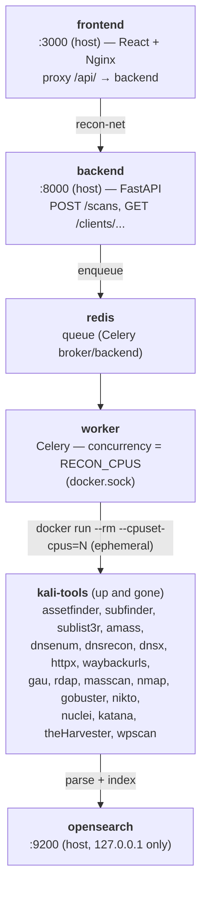
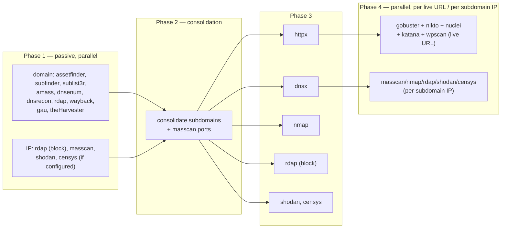

# super-recon

🇧🇷 [Português](README.md) | 🇺🇸 English

Current version: **1.1.0** — see [CHANGELOG.md](CHANGELOG.md).

Automated reconnaissance (recon) platform: runs Kali Linux security tools
against a client's domains/IPs, normalizes each tool's output, and indexes
everything in OpenSearch, with a web dashboard to explore findings by client
and by tool.

Everything runs in Docker. The Kali container is ephemeral — it spins up just
to run one tool and dies right after.

## Architecture



- **Network**: every application service lives on the `recon-net` docker
  network. Ports published on the host (`3000`, `8000`, `9200`) are all
  bound to `127.0.0.1` — never `0.0.0.0`. Reachable only from the local host
  or from other containers on the network.
- **Ephemeral Kali**: the `worker` creates "sibling" containers from the
  `kali-tools:1.0` image via `docker.sock` (docker-outside-of-docker) for
  each tool run, with `--cpuset-cpus` pinning the core used. The container
  dies (`--rm`) as soon as the tool finishes.
- **Parallelism**: the number of CPUs used is `RECON_CPUS` (`.env`); empty
  = use every core on the host. The Celery worker's concurrency is set to
  that value at boot (`backend/entrypoint-worker.sh`).

## Recon pipeline (dependency graph)



Several Phase 1 tools do subdomain enumeration from different sources
(passive, DNS brute-force, certificate transparency, etc.) — the sum tends
to be positive, each one finds something the others don't; they all write to
the same `subdomains` index, only the `tool` field tells them apart. `dnsx`
in Phase 3 resolves/validates the consolidated list (`dns` index), without
relying on brute-force. For domain targets, Phase 3 also resolves the root
domain's IP and runs `rdap` against it (`rdap-network` index) — RDAP returns
the block (CIDR) containing the IP directly, no need to compute the mask.

**`nmap`/`masscan`/`rdap_network` also run per subdomain, not just against
the root domain's IP.** As soon as `dnsx` (Phase 3) resolves each
subdomain's IP, Phase 4 collects the set of unique IPs (deduplicated —
several subdomains behind the same host/CDN don't trigger a repeated scan),
excludes the root domain's IP (already covered in Phase 3), and fires
`rdap_network` + `masscan` in parallel for each remaining IP; the callback
uses the ports `masscan` found to steer `nmap` (instead of the default
top-1000), the same pattern already used for a plain-IP target. `httpx`
doesn't run again against that IP — the hostname resolving to it was already
tested in Phase 3. Private/loopback/reserved IPs (e.g. a subdomain like
`localhost.example.com` pointing to `127.0.0.1`) are
discarded before scanning — without this filter, a malicious or
misconfigured subdomain pointing inward would end up scanning the
infrastructure itself instead of the client's target.

With `SHODAN_API_KEY`/`CENSYS_API_KEY` set, Shodan and/or Censys are also
queried at these same three points (root domain IP, each subdomain's IP,
plain-IP target) — both can be enabled at the same time, they're independent
scanning engines with different coverage. See "Shodan data" and "Censys
data" below.

Since a subdomain's IP can sit on completely different infrastructure than
the root (a PTR that doesn't match the client's domain, for instance), every
per-IP finding (nmap, masscan, shodan, censys) has an "ⓘ" button next to the
IP value in the table — shows, in a short line, whether that IP is the root
domain's own, came from resolving a specific subdomain (dnsx), or was given
directly as the scan target
(`GET /clients/{client}/ip-provenance?ip=...&scan_id=...`).

Phase 4 runs against any URL that httpx got a response from (`alive`), not
just the ones that returned `200` — a 404 on the root doesn't mean "dead",
just that there's no index, and that's exactly the kind of host gobuster
exists to investigate (finds a live path that isn't linked anywhere).
`httpx` runs with `-fr` (follows redirects) so `status_code` reflects the
final destination, and `gobuster` runs with `-r` (follows redirect) for the
same reason.

gobuster has three wordlist profiles selectable per scan (`gobuster_wordlist`
field in `POST /scans`, or the selector in the dashboard form): `common`
(dirb/common.txt, ~4.6k words, default — faster), `big` (dirb/big.txt, ~20k
words — more thorough but much slower; the job timeout goes from 300s to
900s on this profile), and `custom` (wordlist uploaded by the user — see
section below).

### Custom gobuster wordlists

Per-client upload (`POST /clients/{client}/wordlists`, multipart/form-data,
or the "New recon" form in the dashboard, when choosing "Custom"). Since
this is an upload feature, it's handled with the following precautions:

- **Never trusts the filename to write to disk** — the file is saved under
  a server-generated opaque id (`uuid4`); the submitted name is only used,
  sanitized (restricted charset, no path separator), for display. This
  closes off any path-traversal attempt via the filename.
- **Size and content validated before writing**: the upload is read in
  chunks (never materializes the whole file in memory before checking the
  size), rejecting anything above `MAX_WORDLIST_BYTES` (default 5 MiB). The
  content must be plain UTF-8 text (rejects null byte/control characters —
  a sign of binary data), with no line longer than
  `MAX_WORDLIST_LINE_CHARS` (default 512) nor more than `MAX_WORDLIST_LINES`
  (default 200,000) valid lines. nginx also rejects large bodies before they
  reach the backend (`client_max_body_size`), as an extra layer.
- **Per-client limit**: at most `MAX_WORDLISTS_PER_CLIENT` (default 5)
  simultaneous wordlists — avoids unbounded accumulation on disk.
- **Isolation between clients**: a scan can only reference a wordlist that
  belongs to the same client (checked both at scan creation and when
  gobuster actually runs) — a client can't reach another client's upload.
- **Automatic cleanup**: deleting a client (or "clear data") also removes
  the custom wordlist files on disk, not just the metadata index — without
  this, they'd be orphaned on the volume indefinitely.
- Inside gobuster's ephemeral container, the file is mounted **read-only**,
  only that specific file (not the whole wordlists directory).

All limits are configurable via the "Settings" screen (admin), with the
system already running, no restart needed — see "Settings".

```bash
curl -X POST -H "Authorization: Bearer $TOKEN" http://localhost:8000/clients/acme/wordlists -F "file=@my-wordlist.txt"
curl -H "Authorization: Bearer $TOKEN" http://localhost:8000/clients/acme/wordlists
curl -X DELETE -H "Authorization: Bearer $TOKEN" http://localhost:8000/clients/acme/wordlists/<wordlist_id>
```

**Known limitation**: the per-client limit is checked with a read followed
by a write (not atomic) — under truly concurrent uploads (two simultaneous
requests), it's possible to go 1-2 over the limit. Not an issue for normal
use (a single operator or small team), just not a hard lock under
adversarial concurrency.

## Requirements

- Docker + Docker Compose v2
- Linux with `vm.max_map_count >= 262144` (required by OpenSearch — most
  distros already ship with this; if `opensearch` doesn't come up, run
  `sudo sysctl -w vm.max_map_count=262144`)

## Bringing the stack up

```bash
cp .env.example .env      # adjust the passwords before going to production

docker build -t kali-tools:1.0 -f kali/Dockerfile kali/   # kali-tools isn't a compose "service" (see note below)

# The OpenSearch backup folder needs to exist and be writable BEFORE the
# first "up" — if Docker creates it on its own (bind mount), it ends up
# owned by root, and the OpenSearch container (runs as a non-root user)
# can't write to it.
mkdir -p data/opensearch-snapshots && chmod 777 data/opensearch-snapshots

docker compose up -d
```

> The `kali-tools:1.0` image isn't a compose service (it doesn't stay
> running) — it's built separately and used by the `worker` to spin up the
> ephemeral containers:
> ```bash
> docker build -t kali-tools:1.0 -f kali/Dockerfile kali/
> ```

Watch it come up:

```bash
docker compose ps
```

Expected order: `redis` + `opensearch` become `healthy` → `opensearch-init`
runs the index templates and exits (`exited 0`) → `backend` + `worker`
become `healthy` → `frontend` becomes `healthy`. All five services have a
healthcheck (`worker` via `celery inspect ping` — confirms a real connection
to the broker, not just the process being alive; `frontend` via `curl`
against the page served by nginx).

## Usage

### Via the dashboard

Open **http://localhost:3000** (port configurable via `FRONTEND_PORT` in
`.env`, see "Environment variables" below) — "new recon" form (client name +
list of domains/IPs, one per line, + gobuster wordlist profile), then browse
by client and by tool.

At the top, the 🇧🇷/🇬🇧 flags switch the interface language (default:
Portuguese). The switch only affects the interface — labels, buttons,
messages; the data discovered by the tools (subdomains, URLs, finding
descriptions, etc.) stays exactly as found, in no particular language. The
choice is saved in the browser (`localStorage`), so it persists across
sessions. Implemented in `frontend/src/i18n/` — a dictionary
(`translations.js`) mapping each Portuguese string to English; strings with
no entry there stay in Portuguese even with English selected (a safety net,
not the expected behavior — every new interface string should get an entry
there).

### Per-scan tool profiles

Besides gobuster's wordlist, the new-scan form (and the saved-target/
recurrence one) has a checklist of the 8 Phase 4 tools — turn them on/off
per execution, without touching the default configuration (which would
affect every future scan of every client). Phase 1 (passive recon:
assetfinder, subfinder, amass, etc.) isn't part of this checklist — it
always runs together, treated in this project as a positive sum across
overlapping tools.

`DALFOX_ENABLED`/`GOWITNESS_ENABLED`/`KITERUNNER_ENABLED` in the
"Settings" screen (see "Dalfox Data"/"Screenshots (Gowitness)"/"Kiterunner
Data" below) are no longer a hard gate: they now only decide which of the
3 opt-in tools come **checked by default** on a new scan. The checklist
has the final say — you can turn dalfox on for one execution even with
`DALFOX_ENABLED` off, and vice versa. Leave the checklist untouched and
behavior is identical to before this feature.

### Via the API

Every route (except `/health` and `/auth/login`) requires a session token —
see "Authentication and users" below. Log in first, then pass the token in
`Authorization: Bearer <token>`:

```bash
# Login — returns {token, username, role}
TOKEN=$(curl -s -X POST http://localhost:8000/auth/login \
  -H "Content-Type: application/json" \
  -d '{"username": "admin", "password": "admin@superRecon"}' | python3 -c "import sys,json; print(json.load(sys.stdin)['token'])")

# Trigger a recon (gobuster_wordlist is optional, defaults to "common";
# enabled_tools is optional too, defaulting to the 5 traditional tools —
# gobuster/nikto/nuclei/katana/wpscan — plus whichever opt-in ones are on
# in the "Settings" screen; omitting the field reproduces today's
# behavior, an explicit list replaces it entirely, including turning on an
# opt-in tool that's off in Settings)
curl -X POST http://localhost:8000/scans \
  -H "Content-Type: application/json" \
  -H "Authorization: Bearer $TOKEN" \
  -d '{"client": "acme", "targets": ["acme.com", "203.0.113.10"], "gobuster_wordlist": "big", "enabled_tools": ["gobuster", "nuclei", "dalfox"]}'

# Follow a scan's runs
curl -H "Authorization: Bearer $TOKEN" "http://localhost:8000/scans/<scan_id>?client=acme"

# List clients with data
curl -H "Authorization: Bearer $TOKEN" http://localhost:8000/clients

# A client's indices/tools (with doc counts)
curl -H "Authorization: Bearer $TOKEN" http://localhost:8000/clients/acme/indices

# A tool's findings, paginated and filterable
curl -H "Authorization: Bearer $TOKEN" "http://localhost:8000/clients/acme/nuclei?severity=critical&page=1&size=25"

# Clear data: wipes findings + run history, but the client stays in the
# list (zeroed out, as if freshly created) — requires the admin role
curl -X POST -H "Authorization: Bearer $TOKEN" http://localhost:8000/clients/acme/clear

# Delete client: disappears from the client list — requires the admin role
curl -X DELETE -H "Authorization: Bearer $TOKEN" http://localhost:8000/clients/acme
```

"Clear data" (↺ button in the client dashboard) and "delete client" (⚠
button) serve different purposes: the first resets the client to a zeroed
state without removing its name from the list — useful for discarding an old
recon and starting fresh on the same client; the second removes the client
entirely. Neither cancels scans currently queued — they only affect what's
already indexed (to cancel running executions, use the "■ cancel running
scans" button first).

**"Cancel running scans" kills the running/pending jobs *and* stops the
pipeline's next phases from firing.** The pipeline is chained (each phase
triggers the next via a chord callback when the previous one "finishes" —
and Celery counts a forcibly-killed task as "finished" for that purpose);
killing only the jobs visible at click time wasn't enough — the current
phase's callback would still fire the next phase, giving the impression
that new processes kept spawning even after cancelling everything. So
besides killing pending jobs, cancellation also marks the
scan(s) involved as cancelled — every phase-dispatching function checks
that flag before moving forward and bails out early if it's set. A run that
was already genuinely in progress at click time still finishes on its own
(it isn't interrupted mid-flight), but it won't trigger anything further
afterward.

```bash
curl -X POST -H "Authorization: Bearer $TOKEN" http://localhost:8000/clients/acme/jobs/cancel-all
```

`GET /clients/{client}/{suffix}` accepts: `q` (free-text search), `page`,
`size`, `sort` (e.g. `-@timestamp`), and any other parameter becomes an
exact filter on that field — e.g. `?tool=assetfinder`, `?status_code=200`.
Repeating the same parameter filters by multiple values at once (OR
semantics): e.g. `?status=queued&status=running` returns jobs in either
state — that's what powers the multi-select status filter in the
dashboard's "Runs" tab.

`q` searches for "contains the string" anywhere in the value (not just an
exact match) — searching `xxx` finds `xxx.acme.com`, no need to type the
whole value. Special query_string syntax characters (`: / * ( ) ...`) are
automatically escaped, so the typed text is treated as literal, not as a
search expression.

### Deleting specific findings (false positives)

Every row in the findings table has a selection checkbox; selecting one or
more shows an "N selected" bar with a "delete selected" button. Useful for
discarding a one-off false positive without wiping the rest of the index
(different from "clear data", which zeroes out the entire client). Doesn't
apply to the metadata tables (`jobs`/`scans`) — a running job needs to be
cancelled (the "cancel" button on its own row), not deleted outright, or
the container/task would be left orphaned with no record to stop it.

```bash
curl -X POST http://localhost:8000/clients/acme/nuclei/delete \
  -H "Content-Type: application/json" \
  -H "Authorization: Bearer $TOKEN" \
  -d '{"ids": ["<finding _id>", "<another _id>"]}'
```

### Exporting data

In JSON, CSV, or PDF, at the client level (all indices) or a single
index/tool. Also available as buttons in the dashboard.

```bash
# All of the client's findings
curl -H "Authorization: Bearer $TOKEN" "http://localhost:8000/clients/acme/export?format=json" -o acme.json
curl -H "Authorization: Bearer $TOKEN" "http://localhost:8000/clients/acme/export?format=csv"  -o acme.zip   # one CSV per index, inside a .zip
curl -H "Authorization: Bearer $TOKEN" "http://localhost:8000/clients/acme/export?format=pdf"  -o acme.pdf

# Just one index/tool
curl -H "Authorization: Bearer $TOKEN" "http://localhost:8000/clients/acme/nuclei/export?format=csv" -o acme-nuclei.csv

# Per-index export accepts the same filters as the screen (q + any other
# index field becomes an exact filter)
curl -H "Authorization: Bearer $TOKEN" "http://localhost:8000/clients/acme/nuclei/export?format=pdf&severity=critical" -o acme-nuclei-critical.pdf
```

The PDF has a 500-row cap per section (large indices like `katana` go past
10 thousand documents — doesn't fit a readable report); use JSON/CSV for the
full data. PDF columns are curated per tool (e.g. nuclei prioritizes
`severity`/`template_id`/`cve`) — a new index without curation falls back to
an automatic default.

Per-index/tool export respects the filters applied on screen (free-text
search, source tool, severity, status, etc.) — the export buttons in the
frontend already account for whatever is currently filtered. A filtered PDF
records "Filters applied: ..." in the report header, so it's not ambiguous
whether that PDF is a slice or the total. Client-level export (all indices)
doesn't accept filters, since each index has its own field schema.

### Executive report (risk score)

The export above is raw data — one table per index/tool, good for technical
analysis but bad for presenting to a non-technical client ("they don't want
to read 8 tables of nuclei/dalfox/wpscan, they want to know the risk level
and why"). The executive report is an aggregated summary: risk level front
and center, findings by severity, and the most severe findings named — not
raw per-tool data. It shows up as a card at the top of the client
dashboard's "Overview" tab (refreshed whenever the page loads, no PDF
generation needed) and as a ready-to-send PDF:

```bash
# Same data as the dashboard card, in JSON
curl -H "Authorization: Bearer $TOKEN" "http://localhost:8000/clients/acme/risk-report?format=json"

# Report ready to present/send
curl -H "Authorization: Bearer $TOKEN" "http://localhost:8000/clients/acme/risk-report?format=pdf" -o acme-executive-report.pdf
```

**Score methodology** (an in-house heuristic, not a certified standard like
CVSS — it's meant to prioritize the conversation with the client, not to
serve as a formal audit):

| Severity (nuclei/dalfox) | Weight | | WPScan findings |
|---|---|---|---|
| critical | 10 | | Each vulnerability confirmed against WPVulnDB (core/theme/plugin) counts as equivalent to "high" (weight 5) — WPScan doesn't record its own granular severity. |
| high | 5 | | |
| medium | 2 | | |
| low | 1 | | |
| info | 0 | | |

The score is the weighted sum of all of that. Tiers: `0` → None; `1–9` →
Low; `10–24` → Medium; `25–49` → High; `50+` → Critical. A **floor** rule
keeps a single critical finding from hiding behind a low score: 1+
critical never lets the tier drop below "High"; 3+ criticals forces
"Critical", regardless of the weighted sum.

Discovered subdomains, live hosts, and open ports show up in the report as
"attack surface" — useful context, but they **don't count toward the
score** (they aren't a vulnerability by themselves, they just describe how
big the target is).

### Exporting unique values (no duplicates)

Multiple tools finding the same subdomain (the "positive sum" of recon) or
the same scan run again on another day produce expected repeats in the
indices — but sometimes you just want the lean list (e.g. all distinct
subdomains, without duplicating per tool/run). The "export unique" checkbox
(or `?unique=true` in the API) handles this server-side, no need to
dedupe in Excel afterward:

```bash
curl -H "Authorization: Bearer $TOKEN" "http://localhost:8000/clients/acme/subdomains/export?format=csv&unique=true" -o acme-subdomains.csv
```

Two findings are considered "the same" if all of the content matches,
ignoring only the fields that naturally vary between repeats (`tool`,
`scan_id`, `@timestamp`). When grouping, the kept finding merges the tools
that confirmed that piece of data into the `tool` field (e.g.
`["assetfinder", "subfinder"]`) and sums the occurrences in `_dedup_count`
— no "how many sources agree" information is discarded, just the repeated
rows. Combines with the other filters (`q`, `severity`, `scan_id`, etc.) and
works across all three formats (JSON/CSV/PDF); it just doesn't apply to
client-level export (same reason as the filters: each index has its own
schema).

## Authentication and users

Every API route (except `/health` and `/auth/login`) requires login —
without a valid session, the API returns 401 and the frontend shows the
login screen. There's no more shared key (`API_KEY`): each person has
their own user, with one of the three roles below.

| Action | `viewer` | `operator` | `admin` |
|---|---|---|---|
| Read findings, export, risk report, screenshots (all reads) | ✅ | ✅ | ✅ |
| Trigger/cancel scans, manage recurrence, wordlists, delete findings/scans | ❌ | ✅ | ✅ |
| Delete a client / clear a client's data | ❌ | ❌ | ✅ |
| Manage users, view the audit log | ❌ | ❌ | ✅ |
| Change your own password | ✅ | ✅ | ✅ |

### Default user

Since the project is public (anyone can clone it and bring the stack up),
the install already comes up with a seeded administrator user:

```
Username: admin
Password: admin@superRecon
```

**Change that password as soon as possible** — especially before switching
`BACKEND_HOST_BIND`/`FRONTEND_HOST_BIND` to anything other than
`127.0.0.1` (see "Security / known limitations"). Via the UI: the "My
account" menu in the header → "Change my password". Via the API:

```bash
curl -X POST http://localhost:8000/auth/change-password \
  -H "Content-Type: application/json" \
  -H "Authorization: Bearer $TOKEN" \
  -d '{"current_password": "admin@superRecon", "new_password": "a-strong-password-here"}'
```

### Login via the API

```bash
curl -X POST http://localhost:8000/auth/login \
  -H "Content-Type: application/json" \
  -d '{"username": "admin", "password": "admin@superRecon"}'
# {"token": "...", "username": "admin", "role": "admin"}
```

Use the returned `token` in `Authorization: Bearer <token>` for subsequent
calls (or `?token=` in the query string, for export/screenshot links, which
can't send a custom header). The token expires after `SESSION_TTL_DAYS`
days (default 30, configurable in the "Settings" screen) — after that, log
in again.

### User management

Only `admin` can access the "Users" screen in the header: create a user
(username + password, min. 8 characters + role), change an existing user's
role, enable/disable (a disabled user can no longer log in, but stays in
the audit log's history), reset another user's password without knowing
their current one, or delete. Two guardrails: nobody can delete
themselves, and the last active `admin` in the system can't be
deleted/disabled/demoted (so there's always someone able to administer the
system).

### Forgot the password (reset via the database)

If a user loses their password — including `admin` itself, with no other
admin available to reset it via the UI — reset it directly through the
database, without needing to be logged in:

```bash
docker compose exec backend python -m app.reset_password admin new-password-here
```

The first argument is the `username`, the second the new password (min. 8
characters). Works for any user, not just `admin`.

## Audit log

Every action that **changes data** (`POST`/`PUT`/`DELETE`/`PATCH` with a
successful response) gets logged: who did it (username + role), what (the
method + route), and when. Reads (`GET`) aren't logged — only state
changes. Visible only to `admin`, in the "Audit log" tab in the header,
paginated and ordered newest-first; via the API at `GET /audit-log`.

## Settings

"Settings" tab in the header (`admin` only) — edits, live, without touching
`.env` or restarting `backend`/`worker`, the options that make sense to
tune while the system is already running: per-tool timeout, wordlist
upload limits, notifications (Slack/webhook), the health monitor and
recurrence scheduler interval, session token validity, whether gowitness/
dalfox/kiterunner start checked by default in the scan checklist, and the
Shodan/Censys/WPScan keys/tokens (masked like a password field). Every
field has a tip explaining what it does, in the active language.

How it works: the `.env` value stays the factory default (loaded normally
on backend startup); a change saved through the screen becomes an
*override* stored in OpenSearch, applied on top — it survives a backend
restart (reloaded on every startup) and each field has a "restore default"
button to go back to the `.env` value. Changes to the Slack/Shodan/Censys/
WPScan token fields never echo the saved value back to the screen (only
shows "set" or not) — typing a new value overwrites it, an empty field
leaves it untouched. Every change is logged in the audit log (who changed
what, not the value itself).

**Stays `.env`-only** (requires a restart either way, or is
bootstrap-level infrastructure config): worker parallelism (`RECON_CPUS`),
Redis/OpenSearch credentials and bind, backend/frontend network port/bind,
Docker volume paths, and data retention (ILM) — see "Environment
variables" below for the full list, marked "also editable via the
Settings screen".

## Indices in OpenSearch

One index per tool/finding type, named `{client}-{suffix}`:

| Suffix | Tools | Main fields |
|---|---|---|
| `subdomains` | assetfinder, subfinder, sublist3r, amass, dnsenum, dnsrecon | `subdomain`, `domain`, `sources[]` |
| `httpx` | httprobe, httpx | `url`, `status_code`, `alive` |
| `dns` | dnsx | `subdomain`, `ips[]`, `resolved` |
| `wayback` | waybackurls, gau | `url`, `path`, `has_params` |
| `katana` | katana | `url`, `domain` |
| `harvester` | theHarvester | `type` (email/host/ip/asn/url), `value` |
| `rdap-domain` | rdap | `domain`, `nameservers[]`, `registrant`, `events[]` |
| `rdap-network` | rdap | `handle`, `start_address`, `end_address`, `cidr`, `org` |
| `masscan` | masscan | `ip`, `port`, `proto`, `state` |
| `nmap` | nmap | `ip`, `port`, `service`, `product`, `version`, `cpe[]` |
| `shodan` | shodan | `ip`, `port`, `product`, `version`, `cpe[]`, `org`, `isp`, `vulns[]`, `hostnames[]` |
| `censys` | censys | `ip`, `port`, `protocol`, `software[]`, `asn`, `org`, `labels[]` |
| `nikto` | nikto | `host`, `uri`, `description`, `references` |
| `nuclei` | nuclei | `template_id`, `severity`, `matched_at`, `tags[]`, `cve` |
| `dalfox` | dalfox | `type`, `param`, `url`, `payload`, `severity`, `cwe` |
| `gobuster` | gobuster | `url`, `path`, `status_code`, `size` |
| `kiterunner` | kiterunner | `url`, `path`, `method`, `status_code`, `size` |
| `jobs` | (metadata) | `tool`, `target`, `status`, `scan_id`, `doc_count`, `error` |
| `scans` | (metadata) | `scan_id`, `targets[]`, `gobuster_wordlist`, `@timestamp` |
| `wordlists` | (metadata) | `wordlist_id`, `filename`, `line_count`, `size_bytes`, `@timestamp` |

Templates defined in `opensearch/templates/`, applied by the
`opensearch-init` container.

### Identifying which scan a finding came from

Every indexed document (finding or job) has always carried `scan_id` and
`@timestamp` — what was missing was a friendly way to know *which* scan_id
maps to *which* run, since it's just an opaque hex. `POST /scans` now also
writes a record to `{client}-scans` (original targets + date/time),
queryable via:

```bash
curl -H "Authorization: Bearer $TOKEN" http://localhost:8000/clients/acme/scans
```

In the dashboard, this feeds a "scan" selector in the findings and runs
filters (only shows up when the client has more than one recorded scan),
displaying "mm/dd/yyyy hh:mm — targets" instead of the hex. Scanning the
same target again on another day doesn't mix findings indistinguishably: the
"scan" filter (and export, which respects the same filter) make clear which
run each finding came from. A PDF exported with that filter shows "Filters
applied: scan=mm/dd/yyyy hh:mm — targets" in the header for the same reason.

The client panel also has its own "Scans" section, listing each run with
date/time, the exact targets submitted in that trigger, and the wordlist
profile used — useful to directly answer "which targets went into
yesterday's scan vs. today's" (e.g. a client's scope grew and an IP was
added in a second run, keeping the domain from the first). Each row has a
"view runs" link that opens the runs tab already filtered by that specific
`scan_id`.

### Comparing scans ("what changed since last time")

Every row in the "Scans" section (except the oldest) has a "view changes
since previous" link, which compares that scan against the one immediately
before it. You can also check any two scans (checkbox) and click "compare
selected" — useful for comparing non-consecutive runs. This opens a
per-index/tool screen showing:

- **New** — findings that only exist in the more recent scan;
- **Resolved** — findings that only existed in the older one (e.g. a fixed
  vulnerability, a decommissioned subdomain);
- **Unchanged** — findings present in both. Click the block to open/close
  the full list (collapsed by default — usually the least interesting group
  in a comparison, since the point is to focus on what changed).

```bash
curl -H "Authorization: Bearer $TOKEN" "http://localhost:8000/clients/acme/nuclei/compare?from_scan=<older scan_id>&to_scan=<newer scan_id>"
```

Two findings are considered "the same" by the same rule used for "export
unique": all of the content matches, ignoring only `tool`/`scan_id`/
`@timestamp`/`client` (the fields that naturally vary between runs). Doesn't
apply to `jobs`/`scans` (metadata, not findings) — same restriction as
"delete specific findings".

### Deleting a specific scan

Selecting exactly one scan (checkbox) in the "Scans" section shows the
"delete selected scan" button. Unlike "clear data" (which zeroes out the
entire client), this only deletes that one run: the scan record and all
findings/jobs with that `scan_id`, across every index of the client —
findings from other scans aren't affected.

```bash
curl -X DELETE -H "Authorization: Bearer $TOKEN" "http://localhost:8000/clients/acme/scans/<scan_id>"
```

There's no way to know upfront which indices a scan touched (depends on
which phases/tools ran for that target), so the deletion sweeps every
existing index of the client filtering by `scan_id` — the response returns
`deleted_by_suffix` with the count removed from each.

## Project structure

```
super-recon/
├── docker-compose.yml
├── .env.example
├── kali/               # Dockerfile for the kali-tools:1.0 image
├── opensearch/          # index templates + ILM (ISM) policies + init script
│   ├── backup.sh         # takes an OpenSearch snapshot (backup)
│   └── restore.sh        # restores a snapshot
├── backend/
│   ├── app/             # FastAPI + Celery (orchestrator)
│   ├── parsers/          # json/xml/txt -> normalized document, per tool
│   └── tests/            # pytest, each tool's sample output embedded in the tests themselves
├── frontend/             # React + Nginx dashboard
├── data/exchange/        # worker <-> kali container exchange directory (nikto)
├── data/wordlists/        # custom wordlist uploads (gobuster)
├── data/screenshots/       # gowitness screenshots (GOWITNESS_ENABLED)
└── data/opensearch-snapshots/  # backup files (see "OpenSearch backup")
```

## Environment variables (`.env`)

| Variable | Description |
|---|---|
| `RECON_CPUS` | Number of CPUs used for worker parallelism. Empty = all cores on the host. |
| `REDIS_PASSWORD` | Redis (queue) password. |
| `OPENSEARCH_ADMIN_USER` / `OPENSEARCH_ADMIN_PASSWORD` | OpenSearch credentials. |
| `OPENSEARCH_HOST_BIND` | Bind IP for port 9200 on the host (default `127.0.0.1` — don't change to `0.0.0.0`; it's the raw database, with the credentials above). |
| `BACKEND_HOST_BIND` / `FRONTEND_HOST_BIND` | Bind IP for the backend/frontend ports on the host. `127.0.0.1` (default) = local only; `0.0.0.0` = reachable from any IP that can reach the machine (LAN or the internet, if it has a public IP). **Before switching to `0.0.0.0`, change the seeded `admin` user's password** — see "Authentication and users". |
| `BACKEND_PORT` / `FRONTEND_PORT` | Port exposed on the host (default `8000`/`3000`). Change it if already in use — only affects the host side, the internal container port (`8000`/`80`) stays the same. |
| `HTTPS_ENABLED` | Empty (default) = everything over HTTP. Set = turns on HTTPS (requires a certificate in `certs/`) — see the "HTTPS" section. |
| `FRONTEND_HTTPS_PORT` | HTTPS port exposed on the host for the frontend (default `3443`), only relevant with `HTTPS_ENABLED` on. See the "HTTPS" section. |
| `ILM_SHORT_RETENTION_DAYS` / `ILM_LONG_RETENTION_DAYS` | Days until an index automatically expires (ILM/ISM). Empty (default) = never expires. See "Data retention" below. |
| `KITERUNNER_WORDLIST` | Name of the kiterunner wordlist cached at `kali-tools` image build time (default `apiroutes-260227`). Rarely needs to change. |

Per-tool timeout, upload limits, notifications (Slack/webhook), health
monitor, scan recurrence, session, opt-in Phase 4 tools, and the Shodan/
Censys/WPScan keys **are no longer in `.env`** — they're configured with
the system already running, via the "Settings" screen (log in as admin,
see "Settings" above).

## Data retention (ILM)

By default data is kept indefinitely. For automatic expiration, set
`ILM_SHORT_RETENTION_DAYS`/`ILM_LONG_RETENTION_DAYS` in `.env` and run
`docker compose up opensearch-init` (reapplies the config on an already
running cluster, no need to bring down the rest of the stack):

- **Short retention** (`ILM_SHORT_RETENTION_DAYS`) — `wayback`/`katana`:
  high document volume and low long-term value (historical URLs/crawling),
  the indices that weigh the most on the cluster.
- **Long retention** (`ILM_LONG_RETENTION_DAYS`) — everything else: higher-
  value findings (`nuclei`, `subdomains`, `nmap`, etc.) and run metadata
  (`jobs`, `scans`). Catches any index that doesn't match short retention,
  so a tool added in the future is automatically covered by this policy
  without touching anything.

Implemented via ISM (Index State Management, a plugin already bundled in
the OpenSearch image — not a paid feature). Each group is a policy with a
single transition, `active -> delete` after `min_index_age` days;
`ism_template` in the policy body auto-attaches to *new* indices matching
the pattern, and `opensearch-init` retroactively applies it to *already
existing* ones via `_plugins/_ism/add`. Leaving the variable empty skips
creating that policy entirely — no index in that group falls under ISM
management.

```bash
# Check whether an index is under a policy, and its current state
curl -sk -u admin:<password> "https://localhost:9200/_plugins/_ism/explain/acme-nuclei"
```

## OpenSearch backup

Uses OpenSearch's native [Snapshot API](https://opensearch.org/docs/latest/tuning-your-cluster/availability-and-recovery/snapshots/index/)
— no external tool. `opensearch-init` already registers, on every stack
boot, a snapshot repository called `recon-backups` (type `fs`, i.e. a file
on disk) pointing to `data/opensearch-snapshots/` on the host; that
registration just "gets it ready to use" — taking the snapshot itself is
always an explicit action (see below).

**`opensearch-init` failing with exit 22 on the first `docker compose up`**
— the OpenSearch container runs as a non-root user (UID 1000); if
`data/opensearch-snapshots/` doesn't exist before the first boot, Docker
creates the folder on its own owned by `root`, with no write permission for
that user, and registering the snapshot repository fails.
Fixed by `mkdir -p data/opensearch-snapshots && chmod 777
data/opensearch-snapshots` before `docker compose up -d` (already included
in the "Bringing the stack up" instructions — this is only needed if the
folder was already created wrong before this fix).

```bash
# Take a backup (automatic name: backup-YYYYMMDD-HHMMSS)
./opensearch/backup.sh

# Or with a chosen name
./opensearch/backup.sh before-the-migration

# List existing snapshots
./opensearch/restore.sh

# Restore a snapshot (asks for y/N confirmation before restoring)
./opensearch/restore.sh backup-20260705-165144

# Restore only some indices from the snapshot (name pattern, quoted)
./opensearch/restore.sh backup-20260705-165144 "acme-*"
```

Both scripts run from the host (outside any container), using the
credentials from `.env` — they only need `curl`. `backup.sh` includes every
data index of the project (findings, jobs, scans, wordlists) and excludes
OpenSearch/plugin internal indices (`.opendistro-*`,
`security-auditlog-*`, `top_queries-*`).

**Restore is intentionally non-destructive**: OpenSearch refuses to restore
over an index that already exists (`snapshot_restore_exception` error), so
`restore.sh` never deletes anything on its own. If the goal is to really
replace an existing index with an older snapshot version, delete (or close)
it manually first:

```bash
curl -sk -u admin:<password> -X DELETE "https://localhost:9200/acme-nuclei"
```

**This is not an off-host backup.** The snapshot files live in
`data/opensearch-snapshots/`, on the same disk as the original data
(`opensearch-data`) — it protects against human error (an index deleted/
corrupted by accident), but not against disk failure or losing the whole
machine. For real disaster recovery, copy that folder off the host after
each backup (another disk, another machine, S3, rsync to another server,
etc.):

```bash
rsync -av data/opensearch-snapshots/ user@other-host:/backups/super-recon/
```

## Critical-finding notification

"Closes the loop" without having to watch the screen: when a freshly
indexed finding has a severity in `NOTIFY_SEVERITIES` (default `critical` —
currently `nuclei` and `dalfox` write that field), the worker sends a
notification via Slack and/or a generic webhook, whichever is configured
in the "Settings" screen (admin). Off by default (both channels empty).

- **One message per tool run**, not one per finding — a tool that finds
  several at once doesn't flood the channel. The message lists up to 10
  findings (template + host/URL) and summarizes the rest ("+ N").
- **Slack**: uses the real API (`chat.postMessage`), not an "incoming
  webhook" — needs a bot token (`xoxb-...`) with `chat:write` scope, added
  to the target channel (the channel ID, not the name — grab it from "Copy
  channel link" in Slack itself).
- **Generic webhook**: JSON POST (`{"text", "client", "tool", "target",
  "findings"}`) to any URL — compatible with a Slack "Incoming Webhook", or
  your own endpoint. Can be used at the same time as Slack.
- **Never breaks the recon pipeline**: a network failure, invalid token, or
  wrong channel just produces an error log — the tool's job still gets
  marked "ok" normally.

```bash
# Fire via the Slack Web API directly (useful to validate token/channel
# before configuring it in the "Settings" screen)
curl -X POST https://slack.com/api/chat.postMessage \
  -H "Authorization: Bearer $SLACK_BOT_TOKEN" -H "Content-Type: application/json" \
  -d '{"channel":"'"$SLACK_CHANNEL"'","text":"test"}'
```

**Careful with the token**: it's a secret — the "Settings" screen masks
the field (never shows the saved value back, only whether it's set;
typing a new value overwrites it, an empty field leaves it untouched) and
it never appears in code or logs. If the token leaks (e.g. pasted into a
chat), revoke/generate a new one in the Slack app settings and paste the
new value into the screen.

## Platform health monitor

Besides critical findings, the backend also monitors the platform's own
health — queue, worker, cluster — and reuses the same notification channel
(Slack and/or webhook) configured above. Runs in the background inside the
backend's own process (a thread, checking every
`HEALTH_CHECK_INTERVAL_SECONDS`, default 60s) — no need for a new
container, service, or Celery Beat.

Four checks, each isolated (one failing doesn't stop the others from
running):

- **OpenSearch cluster** — status (`green`/`yellow`/`red`) for the
  project's indices only (`*,-.*,-security-auditlog-*,-top_queries-*`, the
  same exclusion pattern as the backup). OpenSearch/plugin internal indices
  stay `yellow` forever on a single-node cluster (waiting for a replica
  that will never be allocated) — without excluding them the monitor would
  flag a problem all the time, even with the project's own data 100%
  healthy.
- **Celery worker** — `control.inspect().ping()`, called from the
  *backend* process (not the worker) — tests from the outside whether any
  worker is alive and responding, not just "the container is up".
- **Queue backlog** — `LLEN` on the Celery queue in Redis; above
  `HEALTH_QUEUE_BACKLOG_THRESHOLD` (default 50) sounds an alarm for a queue
  that isn't being drained.
- **Stuck jobs** — jobs with `running` status (across any client) for
  longer than `HEALTH_STUCK_JOB_MINUTES` (default 60) — e.g. the worker
  died mid-run without updating the status.

**Only notifies on a state transition** (good→bad or bad→good), never on
every check — a persistent problem (a yellow cluster for hours, say) would
generate a single message, not one per minute. The last cycle's result also
shows up in `GET /health` (`platform_problems`), at no extra cost — it
doesn't trigger a new check, it just reads the already-computed result.

`HEALTH_CHECK_INTERVAL_SECONDS <= 0` disables the monitor entirely (the
thread doesn't even start).

> Against a frozen/unreachable Redis, without extra care both the Celery
> ping and the Redis `LLEN` get stuck for tens of seconds (redis-py 8.x
> retries automatically, even with a socket timeout configured) — each
> check runs with its own wait ceiling (10s for the worker, 5s for Redis)
> so the monitor never hangs waiting on a broker that isn't going to
> respond.

## Scan recurrence

Each client can save a set of targets (+ gobuster options) for reuse — from
the client dashboard, "Recorrência" section. A saved target serves two
independent purposes:

- **Manual reuse** ("run now") — fires the same set of targets at any time,
  without filling in the form again.
- **Automatic recurrence** (optional, off by default) — enables periodic
  execution: daily, weekly (on a chosen day of the week), or monthly (on a
  chosen day of the month, 1-31). Months with fewer days than configured
  (e.g. day 31 in February) run on that month's last day instead.

**Time is always UTC**, the same timezone used everywhere else in the
project (`@timestamp`, `started_at`, etc.) — avoids dealing with
timezone/DST conversion. If your timezone isn't UTC, convert the desired
time before configuring it.

Just like the health monitor, it runs in the background inside the
backend's own process (a thread, checking every
`RECURRENCE_CHECK_INTERVAL_SECONDS`, default 60s) — no Celery Beat, no new
container/service. Each cycle, it looks up saved targets with active
recurrence whose "next run" has already arrived, fires a normal scan for
each one (the same pipeline as always), and recalculates the next run.
Firing precision is within ~1 check interval — not a second-precision cron.

`RECURRENCE_CHECK_INTERVAL_SECONDS <= 0` disables the scheduler entirely
(the thread doesn't even start) — saved targets still exist and can still be
used via "run now", only automatic recurrence stops firing.

> **Known limitation**: if the backend restarts right at the instant of a
> firing (between the scan being launched and the next run being
> persisted), there's a small window where the same target could fire
> twice. Acceptable for this feature's scope — the same class of trade-off
> as other parts of the project (see "Security / known limitations").

## Shodan data

Passive per-IP enrichment (org/ISP, ports/banners Shodan already had
indexed, known CVEs) — no active scan time spent, it's just a direct HTTPS
call to Shodan's Host API (no Kali container). Off by default; paste a
`SHODAN_API_KEY` (even the free plan works, at https://account.shodan.io/)
into the "Settings" screen to enable. Runs at the same three points where
`nmap`/`masscan`/
`rdap_network` already run: the root domain's IP, each subdomain's IP
(deduplicated, excluding private/loopback IPs — see "Recon pipeline"), and
plain-IP targets.

**On the free ("Membership") plan, not every IP Shodan has data for is
actually accessible**:

```
IP with a normal finding      -> HTTP 200, data returned normally
IP with no data on Shodan     -> HTTP 404 "No information available for that IP."
IP WITH data on Shodan, but   -> HTTP 403 "Requires membership or higher to access"
outside the free plan's reach
```

The third case (Shodan *does* have information about that IP, but the API
key's plan doesn't grant access to it) is recorded as job `status: error`
with Shodan's own message — deliberately, so it doesn't give the misleading
impression of "we checked and found nothing" when it's actually "we
couldn't even check". There's no predictable pattern upfront for which IPs
fall into which case on the free plan; a paid plan (Freelancer or higher)
gives consistent Host Lookup access for any IP.

The `vulns` field (list of CVEs Shodan has already associated with that
host) comes in different shapes depending on the response (sometimes a
plain list of CVE-ids, sometimes a CVE→details dict) — the parser
normalizes both shapes into a plain list of strings.

## Censys data

Same idea as Shodan above (passive per-IP enrichment, no active scan, direct
HTTPS call — in this case to the Censys Platform API), but a different
scanning engine: different coverage, one finds what the other doesn't,
which is why the two pair well running at the same time. Off by default;
paste a `CENSYS_API_KEY` (access token at https://platform.censys.io/)
into the "Settings" screen to enable. Runs at the same three points as
Shodan: root domain IP, each subdomain's IP, and plain-IP targets.

Notable differences from Shodan:

- **Always responds 200** for a valid IP, even with no services found
  (`"services": []`, including for reserved ranges like TEST-NET) — there's
  no "403 because of the plan" like with Shodan. An IP with no service
  simply produces no document (same behavior as nmap with no open ports),
  never an error.
- **No CVE/vulnerability field** in the host lookup response — the value
  here is different: ASN/organization, WHOIS, and the software identified
  per service (`vendor:product`, e.g. `apache:http_server`), sometimes with
  more than one identification per service (e.g. the web server and the
  framework behind it).
- **Low rate limit on a trial/test key**: a handful of simultaneous calls
  is already enough to produce `429 Too Many Requests` — handled as a
  normal job `status: error` (Shodan and Censys lookups for the same IP
  don't depend on each other, so one failing doesn't affect the other).
  A paid plan has higher limits.

## WPScan data

Unlike Shodan/Censys above (a direct HTTP call, no container), WPScan is a
CLI tool that runs in the ephemeral Kali container, so it follows the same
pattern as nikto/nuclei/katana: it fires automatically against **every live
URL** found in Phase 4 — it doesn't depend on `WPSCAN_API_TOKEN` or any
prior tech-detection. WPScan itself detects whether the target is WordPress
or not: against a non-WordPress target it exits quickly with
`{"scan_aborted": "..."}` instead of findings — no interactive prompt
(unlike dnsrecon, no `echo n |` trick needed here), no hanging job.

**Also runs against subpaths discovered by gobuster** — covers the case of
a WordPress install living in a subfolder instead of the host root (e.g.
`http://site.com/blog`), which Phase 4 alone wouldn't reach (it only runs
on what httpx confirmed alive, typically the root). Once gobuster finishes
for a URL, findings with status 200 whose path has no file extension (e.g.
`/blog`, not `/robots.txt` or `/config.php`) each trigger one more wpscan
run, capped at 5 subpaths per URL.

Default enumeration profile: **`-e vp,vt,u`** — only plugins/themes already
flagged vulnerable by WPVulnDB, plus users. Not a full inventory of
everything installed (that would be much slower on sites with many plugins);
the focus is actionable findings.

`WPSCAN_API_TOKEN` (empty by default, generate one at
https://wpscan.com/api/ and paste it into the "Settings" screen) is
**optional** — without it, version/plugin/theme/
user enumeration still works normally, it just doesn't cross-reference the
vulnerability database (plugin/theme findings won't show up, since the
`vp,vt` profile only exists to flag ones with a known CVE). The free plan
has a per-scan call limit (`vuln_api.requests_remaining` in the response
drops on every run).

WPScan findings **have no normalized severity field** (WPVulnDB doesn't
expose a CVSS-like level in the response) — so they don't trigger the
automatic "critical finding" notification (same treatment as gobuster/
theHarvester today). `finding_type` on the finding indicates its nature:
`core_version`/`core_vulnerability` (WordPress core), `theme_vulnerability`,
`plugin_vulnerability`, `user` (enumerated user), or `interesting` (headers,
exposed XML-RPC, accessible `readme.html`, external WP-Cron, etc.).

Default timeout: 600s (`WPSCAN_TIMEOUT_SECONDS`) — without
`WPSCAN_API_TOKEN`, theme enumeration (`vt`) falls back to brute-forcing
known slugs (one request per candidate); on sites behind a CDN/WAF with a
custom theme, running in parallel with gobuster/nikto/nuclei/katana against
the same URL in Phase 4, this can exceed 300s.

## Screenshots (Gowitness)

**Off by default** — turn on `GOWITNESS_ENABLED` in the "Settings" screen
to make it checked by default (the per-scan checklist, below, still has
the final say). Unlike the other optional integrations (Shodan/
Censys/WPScan), the reason isn't a missing API key: gowitness needs
**Chromium** in the `kali-tools` image (~300MB extra — anyone who rebuilds
the image pays that cost, on or off) and the **`SYS_ADMIN`** capability on
the ephemeral container — without it, Chrome's sandbox doesn't initialize
running as root (no other tool in the project needs this capability). Once
on, it runs in Phase 4 against every live URL, alongside gobuster/nikto/
nuclei/katana/wpscan — but that's just the default now: the "Per-scan tool
profiles" checklist (see "Usage" above) can turn gowitness on for one
execution even with this variable empty, or off even with it set.

Unlike every tool integrated so far, gowitness's main finding is an
**image** (a page screenshot), not text — because of that:

- Files live at `data/screenshots/{client}/` on the host (a new volume,
  outside OpenSearch — an index isn't built to hold large binary blobs).
  They're deleted together when the client is deleted/cleared, same
  treatment as custom wordlists.
- Served via `GET /clients/{client}/screenshots/{screenshot_id}`
  (authenticated like any other route — the link uses `?token=`, since an
  `` tag can't send a custom header) — the frontend never reads
  the file straight off disk.
- The gowitness tab in the dashboard is a **thumbnail gallery** instead of
  the text table used everywhere else — matches the tool's purpose
  (comparing many hosts at a glance). Clicking a thumbnail opens the
  full-size image in a new tab.
- Findings don't include `title`/`technologies`/`tls_*` alone — gowitness's
  full HTML body, headers, and network log aren't indexed (large, low
  search value); only the structured summary fields are.

Default timeout: 120s (`GOWITNESS_TIMEOUT_SECONDS`) — loading a real page
with headless Chrome is heavier than a plain HTTP call; raise it for sites
that take longer to load.

## Dalfox Data

**Off by default** — turn on `DALFOX_ENABLED` in the "Settings" screen to
make it checked by default. Unlike gowitness above, there's no image/capability cost here:
the reason is that in practice dalfox yields few findings (sometimes none)
for the cost of running against every live URL in every scan — turn it on if
you want that XSS coverage. Once on, it runs in Phase 4 against every live
URL, alongside gobuster/nikto/nuclei/katana/wpscan — but that's just the
default for the "Per-scan tool profiles" checklist now (see "Usage" above),
not a hard gate: you can turn dalfox on for one execution even with this
variable empty.

Uses `--skip-headless`: avoids depending on a real Chrome/Chromium (dalfox
uses chromedp internally only for deep DOM XSS) — reflected/verified XSS
(the main use case) still works without headless mode, without needing the
same `SYS_ADMIN` capability gowitness pays for.

Default timeout: 300s (`DALFOX_TIMEOUT_SECONDS`).

## Kiterunner Data

**Off by default** — turn on `KITERUNNER_ENABLED` in the "Settings" screen
to make it checked by default. Same reasoning as dalfox above: no image/capability
cost (it's a Go binary, no Chrome or special capability needed), but it runs
against every live URL in every scan — turn it on if you want that API-route
coverage. Once on, it runs in Phase 4 against every live URL, alongside
gobuster/nikto/nuclei/katana/wpscan — but that's just the default for the
"Per-scan tool profiles" checklist now (see "Usage" above), not a hard
gate: you can turn kiterunner on for one execution even with this variable
empty.

In practice it's "gobuster with a different wordlist": it uses the
`apiroutes-260227` wordlist from [Assetnote](https://wordlist.assetnote.io/)
(real-world API routes compiled from HTTP Archive data — a different source
than gobuster's dirb/common.txt and dirb/big.txt), pre-downloaded at
`kali-tools` image build time. `KITERUNNER_WORDLIST_LINES` (default 5000,
tunable in the "Settings" screen) truncates that wordlist to its first N
lines at scan time — the only tunable knob (no per-scan selector like
gobuster's; see "Custom gobuster wordlists" above for why this tool didn't
get the same treatment).

`GET` only: kiterunner only tests multiple HTTP methods per path in its
"kitebuilder" mode (structured `.kite` files via `-w`, which require an
OpenAPI-like source) — not used here, too complex for this integration.

Default timeout: 300s (`KITERUNNER_TIMEOUT_SECONDS`).

## Per-tool timeout

Every tool has its own timeout (seconds) — the maximum time the orchestrator
waits for the Kali container to finish before giving up and marking the job
as an error. All are adjustable in the "Settings" screen (admin), no
restart needed — the values below are the factory default, used until you
change one via the screen:

| Variable | Default | Variable | Default |
|---|---|---|---|
| `ASSETFINDER_TIMEOUT_SECONDS` | 120 | `THEHARVESTER_TIMEOUT_SECONDS` | 180 |
| `SUBFINDER_TIMEOUT_SECONDS` | 180 | `KATANA_TIMEOUT_SECONDS` | 120 |
| `SUBLIST3R_TIMEOUT_SECONDS` | 180 | `HTTPX_TIMEOUT_SECONDS` | 180 |
| `AMASS_TIMEOUT_SECONDS` | 150 | `DNSX_TIMEOUT_SECONDS` | 120 |
| `DNSENUM_TIMEOUT_SECONDS` | 120 | `MASSCAN_TIMEOUT_SECONDS` | 300 |
| `DNSRECON_TIMEOUT_SECONDS` | 240 | `NMAP_TIMEOUT_SECONDS` | 300 |
| `RDAP_TIMEOUT_SECONDS` | 60 | `NUCLEI_TIMEOUT_SECONDS` | 300 |
| `WAYBACK_TIMEOUT_SECONDS` | 180 | `NIKTO_TIMEOUT_SECONDS` | 240 |
| `GAU_TIMEOUT_SECONDS` | 120 | `WPSCAN_TIMEOUT_SECONDS` | 600 |
| `GOWITNESS_TIMEOUT_SECONDS` | 120 | `DALFOX_TIMEOUT_SECONDS` | 300 |
| `KITERUNNER_TIMEOUT_SECONDS` | 300 | | |

`gobuster` is left out of this list — it already had a configurable timeout
before (`GOBUSTER_CUSTOM_TIMEOUT_SECONDS`, also in the "Settings" screen,
"Wordlist uploads" group — only applies to custom wordlists; the
`common`/`big` profiles have a built-in 300s/900s timeout), just shaped a
bit differently since it's per-profile, not a single value.

**How to know which tool to adjust**: a job erroring with `container não
terminou em Ns` ("container did not finish in Ns") in the runs tab means
exactly that — the tool didn't finish within the configured timeout (not a
real failure on its part; backend error messages are in Portuguese
throughout the project, not translated per UI language). `wayback`/`gau`
(fetch archived URLs) are the most sensitive to this on large/old domains,
but any tool can need more time depending on the target.

### "Read timed out" isn't always the tool — it can be the Docker daemon

Before this behavior existed, a job error with `UnixHTTPConnectionPool ...
Read timed out` could be misleading: it looked like the tool had exceeded
its timeout, but sometimes the real problem was different — the
orchestrator waits for the container to finish through an HTTP call to
`docker.sock` (`container.wait(timeout=N)`), and that call uses `N` itself
as the socket *read* timeout. Under load (many containers running in
parallel, an overloaded host), the **Docker daemon itself** can be slow to
respond even though the container has already finished or is about to —
in that case, raising the per-tool timeout doesn't help: 300-600s timeouts
still getting exceeded across several different tools at once is a sign of
a daemon-level bottleneck, not a tool-level one.

That's why waiting is now done via *polling* (`docker_runner.py`): each
attempt to check "has this container finished?" has a short cap (20s), and
if it fails with a timeout/connection error (a passing daemon hiccup), it's
simply retried — without throwing the job away for nothing. The per-tool
timeout still applies, just as a wall-clock deadline (the sum of every
attempt), not the read timeout of a single HTTP call anymore. If the
`UnixHTTPConnectionPool` error still shows up, or if `container não
terminou em Ns` happens across several tools at once (including fast ones),
that's a sign the host is undersized for the amount of parallel
containers — consider lowering `RECON_CPUS` in `.env` (caps the worker's
concurrency) before simply raising timeouts further.

### `wayback`: a record cap instead of a bigger timeout

Some domains have a genuinely huge archived history on the Wayback
Machine — for example `acme.com` (a generic domain used as a
placeholder in countless tutorials/templates over the years): the CDX API
can fail to finish responding even after **300s**, with dozens of MB
already downloaded. No fixed timeout reliably solves that (there's always a bigger
domain out there), so `wayback` no longer calls `waybackurls` directly
(which downloads the whole response in one shot, all-or-nothing) — it uses
its own paginated fetch (`backend/app/wayback_fetch.py`) that:

- pages through the CDX API itself (`resumeKey`), one page of 10k URLs at a
  time, each with a short timeout (60s) and a few retries before giving up
  on just that page (not the whole job);
- stops on its own once it hits a record cap — `WAYBACK_MAX_RECORDS`
  ("Settings" screen, default **200000**) — bounding runtime by data
  volume instead of relying solely on `WAYBACK_TIMEOUT_SECONDS`;
- writes results page by page (not at the end): if `WAYBACK_TIMEOUT_SECONDS`
  still gets exceeded before the record cap is reached, whatever was
  collected up to that point is kept (indexed normally) instead of thrown
  away — this behavior is generic in `docker_runner.run()`, it applies to
  any tool that writes its `output_file` incrementally.

## HTTPS

Off by default (`HTTPS_ENABLED` empty in `.env`) — everything in plain
HTTP, as always. Before exposing the project beyond `127.0.0.1` (see
"Security" below), it's worth turning on.

### How to turn it on

1. Put a certificate at `./certs/fullchain.pem` and `./certs/privkey.pem`
   (Let's Encrypt-style names) — see "Generating a self-signed certificate"
   and "Installing a real certificate" below.
2. In `.env`: `HTTPS_ENABLED=true` (any non-empty value turns it on) and,
   optionally, `FRONTEND_HTTPS_PORT` (default `3443`).
3. `docker compose build backend frontend && docker compose up -d backend frontend`
   (check `GET /jobs/active` first if a scan is running — see "Usage").

What changes, once on:

- **Frontend** (dashboard): the usual HTTP port (`FRONTEND_PORT`, default
  `3000`) now only returns a redirect (`301`) to HTTPS, on the new
  `FRONTEND_HTTPS_PORT` port (default `3443`). Visiting `http://` still
  works — it just now lands on `https://` automatically.
- **Backend** (API): now responds **HTTPS only**, on the same usual
  `BACKEND_PORT` (default `8000`) — no redirect. Unlike the frontend, the
  API is consumed by `curl`/scripts, not "visited" in a browser; running a
  second process just to redirect isn't worth it. Once turned on, this
  README's `curl` examples need to swap `http://` for `https://` (and,
  with a self-signed certificate, add `-k` to skip validation — see
  below).
- Without the certificate at both expected paths, `backend` and `frontend`
  refuse to start (clear error in the logs, `docker compose logs backend`/
  `frontend`) — they don't silently come up broken over HTTP instead.

### Generating a self-signed certificate (dev/testing)

```bash
./certs/generate-self-signed-cert.sh
```

Generates `certs/fullchain.pem` + `certs/privkey.pem`, valid for ~825
days, `CN=localhost`. The browser will flag "connection not secure" —
**expected**, a self-signed cert has no trusted CA behind it. For local
development that's just clicking "proceed anyway"; to get rid of the
warning, import `certs/fullchain.pem` as a trusted authority in your
OS/browser settings (out of scope for this README — varies by system).

### Installing a real certificate

Any valid certificate works — it just needs to become these two files:

```bash
cp your-certificate.pem certs/fullchain.pem
cp your-private-key.pem certs/privkey.pem
docker compose up -d backend frontend   # reload with the new certificate
```

For a public domain (e.g. with Let's Encrypt/`certbot`), generate the
certificate on the host as usual (`certbot certonly --standalone` or
similar, with `docker compose down`/ports freed up during issuance) and
copy `fullchain.pem`/`privkey.pem` from
`/etc/letsencrypt/live/your-domain/` into `certs/`. Renewal: since the
certificate is just read from a file on the host, renewing means copying
the new files over and running `docker compose up -d backend frontend`
again (can be automated in a certbot renewal cron/hook).

## Security / known limitations

- The `worker` has `/var/run/docker.sock` mounted (required to create the
  Kali ephemeral containers) — equivalent to root access on the host. It's
  an accepted trade-off to allow Docker-based orchestration; don't expose
  that container beyond the local environment.
- `rdap_domain` only works for the registrable domain (e.g. `nmap.org`),
  not for arbitrary subdomains (e.g. `scanme.nmap.org`) — a limitation of
  the RDAP protocol itself, not the implementation. The job shows up as
  `status: error` in the `jobs` index when this happens; the rest of the
  pipeline's tools aren't affected.
- **Exposure beyond localhost**: by default, every port published on the
  host (`opensearch`, `backend`, `frontend`) explicitly binds to
  `127.0.0.1`. `BACKEND_HOST_BIND`/`FRONTEND_HOST_BIND` (`.env`) make this
  configurable — useful for accessing over the LAN or running on a VPS with
  a public IP. Every API route (except `/health` and `/auth/login`)
  requires login — see "Authentication and users" — but **before switching
  to `0.0.0.0` (or a non-loopback IP), change the password of the seeded
  `admin` user** (`admin` / `admin@superRecon`, a public credential
  documented in this README): until it's changed, anyone who discovers the
  port and knows that default credential has full access.
  `OPENSEARCH_HOST_BIND` is independent and should always stay at
  `127.0.0.1` (it's the raw database, with OpenSearch's admin credentials,
  unrelated to the application's login). Before exposing beyond
  `127.0.0.1`, it's also worth turning on HTTPS (see "HTTPS" above) —
  without it, login/password and the session token travel in plain text
  over the network.
- The application's user system is self-contained (users/sessions/audit
  log stored in OpenSearch indices, passwords hashed with bcrypt) — there's
  no LDAP/SSO/OAuth integration. Fine for the intended use (a small team
  running its own instance), not for broad public exposure without a
  VPN/reverse proxy in front.
- `amass` runs with `-r 1.1.1.1,8.8.8.8` (explicit resolvers) — without
  this, v4 hangs indefinitely qualifying dozens of public resolvers,
  something observed reproducibly in a containerized environment.
- `dnsrecon` runs with only `-t std,brt` (standard + brute-force), without
  the `bing` module: in a real test, the Bing search returned made-up
  subdomains (misparsed URL fragments, e.g. `3ascanme.nmap.org`) that go
  unnoticed on domains with wildcard DNS. Subdomain tools from other
  sources (Findomain, DNSmap, Knock, Naabu, Photon) were deliberately left
  out for redundancy with what's already in the pipeline.
