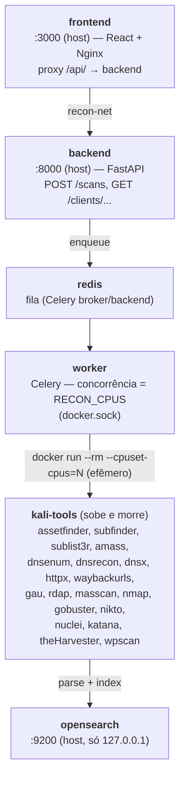
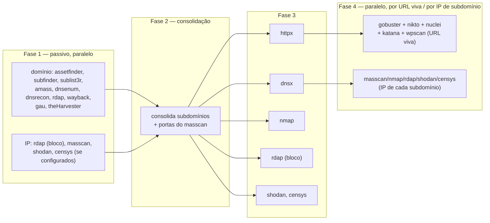

# super-recon

🇧🇷 Português | 🇺🇸 [English](README.en.md)

Versão atual: **1.0.0** — ver [CHANGELOG.md](CHANGELOG.md).

Plataforma de reconhecimento (recon) automatizado: dispara ferramentas de
segurança do Kali Linux contra domínios/IPs de um cliente, normaliza a saída
de cada ferramenta e indexa tudo no OpenSearch, com um dashboard web para
explorar os achados por cliente e por ferramenta.

Tudo roda em Docker. O container do Kali é efêmero — sobe só para executar
uma ferramenta e morre logo em seguida.

## Arquitetura



- **Rede**: todos os serviços da aplicação ficam na rede docker `recon-net`.
  As portas publicadas no host (`3000`, `8000`, `9200`) são todas bindadas em
  `127.0.0.1` — nunca em `0.0.0.0`. Só acessíveis do host local ou de outros
  containers da rede.
- **Kali efêmero**: o `worker` cria containers "irmãos" da imagem
  `kali-tools:1.0` via `docker.sock` (docker-outside-of-docker) para cada
  execução de ferramenta, com `--cpuset-cpus` fixando o core usado. O
  container morre (`--rm`) assim que a ferramenta termina.
- **Paralelismo**: a quantidade de CPUs usada é `RECON_CPUS` (`.env`); vazio
  = usa todos os cores do host. A concorrência do worker Celery é ajustada
  para esse valor no boot (`backend/entrypoint-worker.sh`).

## Pipeline de recon (grafo de dependências)



Várias ferramentas da Fase 1 fazem enumeração de subdomínio por fontes
diferentes (passiva, brute-force de DNS, certificado, etc.) — a soma tende a
ser positiva, cada uma encontra algo que as outras não encontram; todas
gravam no mesmo índice `subdomains`, só o campo `tool` diferencia a origem.
`dnsx` na Fase 3 resolve/valida a lista consolidada (índice `dns`), sem
depender de brute-force. Para alvos de domínio, a Fase 3 também resolve o IP
do domínio raiz e roda `rdap` nesse IP (índice `rdap-network`) — o RDAP devolve
o bloco (CIDR) que contém o IP diretamente, sem precisar calcular a máscara.

**`nmap`/`masscan`/`rdap_network` também rodam por subdomínio, não só no IP do
domínio raiz.** Assim que o `dnsx` (Fase 3) resolve o IP de cada subdomínio, a
Fase 4 pega o conjunto de IPs únicos (deduplicado — vários subdomínios atrás
do mesmo host/CDN não geram scan repetido), exclui o IP do domínio raiz (já
coberto na Fase 3) e dispara `rdap_network` + `masscan` em paralelo pra cada
IP restante; o callback usa as portas que o `masscan` achou pra direcionar o
`nmap` (em vez do top-1000 padrão), o mesmo padrão já usado pra alvo IP puro.
`httpx` não roda de novo nesse IP — o hostname que resolve pra ele já foi
testado na Fase 3. IPs privados/loopback/reservados (ex: um subdomínio tipo
`localhost.exemplo.com` apontando pra `127.0.0.1`) são
descartados antes de escanear — sem esse filtro, um subdomínio malicioso ou
mal-configurado apontando pra dentro escanearia a própria infraestrutura em
vez do alvo do cliente.

Com `SHODAN_API_KEY`/`CENSYS_API_KEY` configuradas, Shodan e/ou Censys também
são consultadas nesses mesmos três pontos (IP do domínio raiz, IP de cada
subdomínio, alvo IP puro) — os dois podem ficar ligados ao mesmo tempo, são
motores de varredura independentes com cobertura diferente. Ver "Dados do
Shodan" e "Dados da Censys" abaixo.

Como um IP de subdomínio pode estar numa infraestrutura totalmente diferente
da raiz (PTR que não bate com o domínio do cliente, por exemplo), cada achado
por IP (nmap, masscan, shodan, censys) tem um botão "ⓘ" ao lado do valor do
IP na tabela — mostra de forma curta se aquele IP é o do domínio raiz, veio
da resolução de um subdomínio específico (dnsx), ou foi informado direto
como alvo do scan (`GET /clients/{client}/ip-provenance?ip=...&scan_id=...`).

A Fase 4 roda em qualquer URL que o httpx conseguiu obter resposta (`alive`),
não só nas que devolveram `200` — um 404 na raiz não quer dizer "morto", só
que não tem index, e é exatamente esse tipo de host que o gobuster existe
para investigar (acha caminho vivo que não está linkado em lugar nenhum).
`httpx` roda com `-fr` (segue redirects) para que o `status_code` reflita o
destino final, e o `gobuster` roda com `-r` (segue redirect) pelo mesmo
motivo.

O gobuster tem três perfis de wordlist selecionáveis por scan (campo
`gobuster_wordlist` em `POST /scans`, ou o seletor no formulário do
dashboard): `common` (dirb/common.txt, ~4.6k palavras, padrão — mais rápido),
`big` (dirb/big.txt, ~20k palavras — mais completo, porém bem mais lento; o
timeout do job sobe de 300s para 900s nesse perfil) e `custom` (wordlist
enviada pelo próprio usuário — ver seção abaixo).

### Wordlists customizadas do gobuster

Upload por cliente (`POST /clients/{client}/wordlists`, multipart/form-data,
ou pelo formulário "Novo recon" no dashboard, ao escolher "Personalizada").
Como é um recurso de upload, é tratado com os seguintes cuidados:

- **Nunca confia no nome do arquivo para gravar em disco** — o arquivo é
  salvo com um id opaco gerado no servidor (`uuid4`); o nome enviado só é
  usado, sanitizado (charset restrito, sem separador de path), para exibição.
  Isso fecha qualquer tentativa de path traversal via nome de arquivo.
- **Tamanho e conteúdo validados antes de gravar**: o upload é lido em blocos
  (nunca materializa o arquivo inteiro em memória antes de checar o
  tamanho), rejeitando acima de `MAX_WORDLIST_BYTES` (padrão 5 MiB). O
  conteúdo precisa ser texto UTF-8 puro (rejeita byte nulo/caracteres de
  controle — sinal de binário), sem linhas acima de `MAX_WORDLIST_LINE_CHARS`
  (padrão 512) nem mais que `MAX_WORDLIST_LINES` (padrão 200.000) linhas
  válidas. nginx também rejeita corpos grandes antes de chegar no backend
  (`client_max_body_size`), como uma camada extra.
- **Limite por cliente**: no máximo `MAX_WORDLISTS_PER_CLIENT` (padrão 5)
  wordlists simultâneas — evita acúmulo sem controle no disco.
- **Isolamento entre clientes**: um scan só pode referenciar uma wordlist que
  pertença ao mesmo cliente (checado tanto na criação do scan quanto na hora
  de rodar o gobuster de fato) — um cliente não acessa o upload de outro.
- **Limpeza automática**: excluir um cliente (ou "limpar dados") remove
  também os arquivos das wordlists customizadas em disco, não só o índice de
  metadados — sem isso, ficariam órfãos no volume indefinidamente.
- No container efêmero do gobuster, o arquivo é montado **somente leitura**,
  só aquele arquivo específico (não o diretório inteiro de wordlists).

Todos os limites são configuráveis pela tela "Configurações" (admin), com
o sistema já no ar, sem precisar reiniciar nada — ver seção
"Configurações".

```bash
curl -X POST -H "Authorization: Bearer $TOKEN" http://localhost:8000/clients/acme/wordlists -F "file=@minha-wordlist.txt"
curl -H "Authorization: Bearer $TOKEN" http://localhost:8000/clients/acme/wordlists
curl -X DELETE -H "Authorization: Bearer $TOKEN" http://localhost:8000/clients/acme/wordlists/<wordlist_id>
```

**Limitação conhecida**: o limite por cliente é checado com uma leitura
seguida de escrita (não é atômico) — sob upload verdadeiramente concorrente
(duas requisições simultâneas), é possível passar o limite por 1-2 unidades.
Não é um problema para o uso normal (um operador ou time pequeno), só não é
uma trava dura sob concorrência adversarial.

## Requisitos

- Docker + Docker Compose v2
- Linux com `vm.max_map_count >= 262144` (exigido pelo OpenSearch — a maioria
  das distros já vem assim; se o `opensearch` não subir, rode
  `sudo sysctl -w vm.max_map_count=262144`)

## Subindo o stack

```bash
cp .env.example .env      # ajuste as senhas antes de ir para produção

docker build -t kali-tools:1.0 -f kali/Dockerfile kali/   # kali-tools não é um "service" do compose (ver nota abaixo)

# Pasta do backup do OpenSearch precisa existir e ser gravável ANTES do
# primeiro "up" — se o Docker criar sozinho (bind mount), fica dona de
# root, e o container do OpenSearch (roda como usuário não-root) não
# consegue escrever nela.
mkdir -p data/opensearch-snapshots && chmod 777 data/opensearch-snapshots

docker compose up -d
```

> A imagem `kali-tools:1.0` não é um serviço do compose (ela não fica em
> execução) — é construída à parte e usada pelo `worker` para subir os
> containers efêmeros:
> ```bash
> docker build -t kali-tools:1.0 -f kali/Dockerfile kali/
> ```

Acompanhe a subida:

```bash
docker compose ps
```

Ordem esperada: `redis` + `opensearch` ficam `healthy` → `opensearch-init`
roda os templates de índice e sai (`exited 0`) → `backend` + `worker` ficam
`healthy` → `frontend` fica `healthy`. Todos os cinco serviços têm healthcheck
(`worker` via `celery inspect ping` — confirma conexão real com o broker, não
só o processo vivo; `frontend` via `curl` na página servida pelo nginx).

## Uso

### Pelo dashboard

Abra **http://localhost:3000** (porta configurável via `FRONTEND_PORT` no
`.env`, ver "Variáveis de ambiente" abaixo) — formulário "novo recon" (nome
do cliente + lista de domínios/IPs, um por linha, + perfil de wordlist do
gobuster), depois navegue pelos clientes e pelas ferramentas.

No topo, as bandeirinhas 🇧🇷/🇬🇧 trocam o idioma da interface (padrão:
português). A troca é só de interface — rótulos, botões, mensagens; os
dados descobertos pelas ferramentas (subdomínios, URLs, descrições de
achados etc.) continuam exatamente como foram encontrados, em nenhum idioma
específico. A escolha fica salva no navegador (`localStorage`), então
persiste entre sessões. Implementado em `frontend/src/i18n/` — um dicionário
(`translations.js`) mapeando cada texto em português para o inglês; textos
sem entrada lá continuam em português mesmo com o inglês selecionado (uma
rede de segurança, não o comportamento esperado — toda string de interface
nova deve ganhar uma entrada ali).

### Perfis de scan por execução

Além da wordlist do gobuster, o formulário de novo scan (e o de alvo salvo/
recorrência) tem um checklist das 8 ferramentas da Fase 4 — dá pra ligar/
desligar por execução, sem precisar mudar a configuração padrão (que
afetaria todo scan futuro de todo cliente). A Fase 1 (recon passivo:
assetfinder, subfinder, amass etc.) não entra nesse checklist — continua
sempre rodando junto, é tratada no projeto como soma positiva entre
ferramentas sobrepostas.

`DALFOX_ENABLED`/`GOWITNESS_ENABLED`/`KITERUNNER_ENABLED` na tela
"Configurações" (ver "Dados do Dalfox"/"Screenshots (Gowitness)"/"Dados do
Kiterunner" abaixo) deixaram de ser um hard-gate: agora só definem quais
das 3 ferramentas opt-in vêm **marcadas por padrão** num scan novo. O
checklist manda — dá pra ligar dalfox numa execução pontual mesmo com
`DALFOX_ENABLED` desligado, e vice-versa. Sem tocar no checklist, o
comportamento é idêntico a antes dessa feature.

### Pela API

Toda rota (exceto `/health` e `/auth/login`) exige um token de sessão — ver
"Autenticação e usuários" abaixo. Login primeiro, depois o token em
`Authorization: Bearer <token>`:

```bash
# Login — devolve {token, username, role}
TOKEN=$(curl -s -X POST http://localhost:8000/auth/login \
  -H "Content-Type: application/json" \
  -d '{"username": "admin", "password": "admin@superRecon"}' | python3 -c "import sys,json; print(json.load(sys.stdin)['token'])")

# Disparar um recon (gobuster_wordlist é opcional, default "common";
# enabled_tools é opcional, default = as 5 tradicionais do gobuster/nikto/
# nuclei/katana/wpscan + as opt-in ligadas na tela "Configurações" — omitir
# o campo reproduz o comportamento de sempre; uma lista explícita substitui
# por completo, inclusive ligando uma opt-in desligada na tela)
curl -X POST http://localhost:8000/scans \
  -H "Content-Type: application/json" \
  -H "Authorization: Bearer $TOKEN" \
  -d '{"client": "acme", "targets": ["acme.com", "203.0.113.10"], "gobuster_wordlist": "big", "enabled_tools": ["gobuster", "nuclei", "dalfox"]}'

# Acompanhar as execuções de um scan
curl -H "Authorization: Bearer $TOKEN" "http://localhost:8000/scans/<scan_id>?client=acme"

# Listar clientes com dados
curl -H "Authorization: Bearer $TOKEN" http://localhost:8000/clients

# Índices/ferramentas de um cliente (com contagem de docs)
curl -H "Authorization: Bearer $TOKEN" http://localhost:8000/clients/acme/indices

# Achados de uma ferramenta, paginado e filtrável
curl -H "Authorization: Bearer $TOKEN" "http://localhost:8000/clients/acme/nuclei?severity=critical&page=1&size=25"

# Limpar dados: apaga achados + histórico de execuções, mas o cliente
# continua na lista (zerado, como se fosse recém-criado) — exige papel admin
curl -X POST -H "Authorization: Bearer $TOKEN" http://localhost:8000/clients/acme/clear

# Excluir cliente: some da lista de clientes — exige papel admin
curl -X DELETE -H "Authorization: Bearer $TOKEN" http://localhost:8000/clients/acme
```

"Limpar dados" (botão ↺ no dashboard do cliente) e "excluir cliente" (botão
⚠) resolvem propósitos diferentes: o primeiro reseta o cliente para um
estado zerado sem remover seu nome da lista — útil para descartar um recon
antigo e começar de novo no mesmo cliente; o segundo remove o cliente por
completo. Nenhum dos dois cancela scans em andamento na fila — só afeta o
que já foi indexado (para cancelar execuções, use o botão "■ cancelar scans
em andamento" antes).

**"Cancelar scans em andamento" mata os jobs em execução/pendentes *e*
impede as próximas fases do pipeline de disparar.** O pipeline é encadeado
(cada fase dispara a seguinte via chord callback quando a fase anterior
termina — e o Celery conta uma tarefa morta à força como "terminada" pra
esse efeito); matar só os jobs visíveis no momento do clique não bastava —
o callback da fase atual ainda disparava a fase seguinte, dando a impressão
de que processos novos continuavam subindo mesmo depois de cancelar tudo.
Por isso, além de matar os jobs pendentes, o cancelamento
marca o(s) scan(s) envolvido(s) como cancelado — toda função de despacho de
fase confere essa marca antes de avançar e desiste cedo se estiver marcada.
Uma execução que já estava rodando bem no instante do clique ainda termina
sozinha (não é interrompida no meio), mas não dispara mais nada depois.

```bash
curl -X POST -H "Authorization: Bearer $TOKEN" http://localhost:8000/clients/acme/jobs/cancel-all
```

`GET /clients/{client}/{suffix}` aceita: `q` (busca livre), `page`, `size`,
`sort` (ex: `-@timestamp`), e qualquer outro parâmetro vira filtro exato
sobre o campo — ex: `?tool=assetfinder`, `?status_code=200`. Repetir o mesmo
parâmetro filtra por múltiplos valores ao mesmo tempo (semântica OR): ex:
`?status=queued&status=running` traz jobs em qualquer um dos dois estados
— é isso que alimenta o seletor de status (múltipla escolha) na aba
"Execuções" do dashboard.

`q` busca por "contém a string" em qualquer parte do valor (não só match
exato) — buscar `xxx` encontra `xxx.acme.com`, não precisa digitar o valor
inteiro. Caracteres especiais da sintaxe do query_string (`: / * ( ) ...`)
são escapados automaticamente, então a busca trata o texto digitado como
literal, não como uma expressão de busca.

### Excluindo achados específicos (falsos positivos)

Cada linha da tabela de achados tem um checkbox de seleção; marcando uma ou
mais, aparece uma barra "N selecionado(s)" com o botão "excluir
selecionados". Útil para descartar um falso positivo pontual sem apagar o
resto do índice (isso é diferente de "limpar dados", que zera o cliente
inteiro). Não vale para as tabelas de metadados (`jobs`/`scans`) — um job em
andamento precisa ser cancelado (botão "cancelar" na própria linha), não
apagado direto, senão o container/task fica órfão sem registro para parar.

```bash
curl -X POST http://localhost:8000/clients/acme/nuclei/delete \
  -H "Content-Type: application/json" \
  -H "Authorization: Bearer $TOKEN" \
  -d '{"ids": ["<_id do achado>", "<outro _id>"]}'
```

### Exportando dados

Em JSON, CSV ou PDF, no nível do cliente (todos os índices) ou de um único
índice/ferramenta. Também disponível como botões no dashboard.

```bash
# Todos os achados do cliente
curl -H "Authorization: Bearer $TOKEN" "http://localhost:8000/clients/acme/export?format=json" -o acme.json
curl -H "Authorization: Bearer $TOKEN" "http://localhost:8000/clients/acme/export?format=csv"  -o acme.zip   # um CSV por índice, dentro de um .zip
curl -H "Authorization: Bearer $TOKEN" "http://localhost:8000/clients/acme/export?format=pdf"  -o acme.pdf

# Só um índice/ferramenta
curl -H "Authorization: Bearer $TOKEN" "http://localhost:8000/clients/acme/nuclei/export?format=csv" -o acme-nuclei.csv

# Exportação por índice aceita os mesmos filtros da tela (q + qualquer
# outro campo do índice vira filtro exato)
curl -H "Authorization: Bearer $TOKEN" "http://localhost:8000/clients/acme/nuclei/export?format=pdf&severity=critical" -o acme-nuclei-critical.pdf
```

O PDF tem um teto de 500 linhas por seção (índices grandes como `katana`
passam de 10 mil documentos — não cabe num relatório legível); use JSON/CSV
para o dado completo. As colunas do PDF são curadas por ferramenta (ex:
nuclei prioriza `severity`/`template_id`/`cve`) — um índice novo sem
curadoria cai num fallback automático.

A exportação por índice/ferramenta respeita os filtros aplicados na tela
(busca livre, ferramenta de origem, severidade, status etc.) — os botões de
exportar no frontend já levam em conta o que está filtrado no momento. O PDF
filtrado registra "Filtros aplicados: ..." no cabeçalho do relatório, para
não ficar ambíguo se aquele PDF é um recorte ou o total. A exportação em
nível de cliente (todos os índices) não aceita filtros, já que cada índice
tem seu próprio schema de campos.

### Relatório executivo (score de risco)

A exportação acima é dado bruto — uma tabela por índice/ferramenta, boa pra
análise técnica mas ruim pra apresentar a um cliente não-técnico ("ele não
quer ler 8 tabelas de nuclei/dalfox/wpscan, quer saber qual é o nível de
risco e por quê"). O relatório executivo é uma síntese agregada: nível de
risco em destaque, achados por severidade, e os achados mais graves
nomeados — em vez de dado bruto por ferramenta. Aparece como card no topo
da aba "Visão geral" do dashboard (atualizado sempre que a tela carrega,
sem precisar gerar PDF) e como PDF pronto pra enviar:

```bash
# Mesmo dado do card do dashboard, em JSON
curl -H "Authorization: Bearer $TOKEN" "http://localhost:8000/clients/acme/risk-report?format=json"

# Relatório pronto pra apresentar/enviar
curl -H "Authorization: Bearer $TOKEN" "http://localhost:8000/clients/acme/risk-report?format=pdf" -o acme-relatorio-executivo.pdf
```

**Metodologia do score** (heurística própria, não é um padrão certificado
tipo CVSS — serve pra priorizar conversa com o cliente, não pra
auditoria formal):

| Severidade (nuclei/dalfox) | Peso | | Achados WPScan |
|---|---|---|---|
| critical | 10 | | Cada vulnerabilidade confirmada contra a WPVulnDB (core/tema/plugin) conta como equivalente a "high" (peso 5) — o WPScan não grava severidade granular própria. |
| high | 5 | | |
| medium | 2 | | |
| low | 1 | | |
| info | 0 | | |

O score é a soma ponderada de tudo isso. Faixas: `0` → Nenhum; `1–9` →
Baixo; `10–24` → Médio; `25–49` → Alto; `50+` → Crítico. Um **piso**
evita que um achado crítico isolado fique escondido atrás de um score
baixo: 1+ crítico nunca deixa o nível cair abaixo de "Alto"; 3+ críticos
força "Crítico", independente da soma ponderada.

Subdomínios descobertos, hosts vivos e portas abertas aparecem no relatório
como "superfície de ataque" — contexto útil, mas **não entram no score**
(não são uma vulnerabilidade em si, só descrevem o tamanho do alvo).

### Exportando valores únicos (sem duplicidade)

Múltiplas ferramentas achando o mesmo subdomínio (a "soma positiva" do
recon) ou o mesmo scan rodado de novo em outro dia geram repetições
esperadas nos índices — mas às vezes você só quer a lista enxuta (ex: todos
os subdomínios distintos, sem duplicar por ferramenta/execução). O checkbox
"exportar únicos" (ou `?unique=true` na API) resolve isso do lado do
servidor, sem precisar deduplicar no Excel depois:

```bash
curl -H "Authorization: Bearer $TOKEN" "http://localhost:8000/clients/acme/subdomains/export?format=csv&unique=true" -o acme-subdominios.csv
```

Dois achados são considerados "o mesmo" se todo o conteúdo bate, ignorando
só os campos que naturalmente variam entre repetições (`tool`, `scan_id`,
`@timestamp`). Ao agrupar, o achado mantido junta as ferramentas que
confirmaram aquele dado no campo `tool` (ex: `["assetfinder", "subfinder"]`)
e soma as ocorrências em `_dedup_count` — nenhuma informação de "quantas
fontes concordam" é descartada, só a repetição de linhas. Combina com os
demais filtros (`q`, `severity`, `scan_id` etc.) e funciona nos três
formatos (JSON/CSV/PDF); só não se aplica à exportação em nível de cliente
(mesma razão dos filtros: cada índice tem seu próprio schema).

## Autenticação e usuários

Toda rota da API (exceto `/health` e `/auth/login`) exige login — sem
sessão válida, a API responde 401 e o frontend mostra a tela de login. Não
existe mais chave compartilhada (`API_KEY`): cada pessoa tem seu próprio
usuário, com um dos três papéis abaixo.

| Ação | `viewer` | `operator` | `admin` |
|---|---|---|---|
| Ler achados, exportar, risk report, screenshots (toda leitura) | ✅ | ✅ | ✅ |
| Disparar/cancelar scan, gerenciar recorrência, wordlists, excluir achados/scan | ❌ | ✅ | ✅ |
| Excluir cliente / limpar dados do cliente | ❌ | ❌ | ✅ |
| Gerenciar usuários, ver log de auditoria | ❌ | ❌ | ✅ |
| Trocar a própria senha | ✅ | ✅ | ✅ |

### Usuário padrão

Como o projeto é público (qualquer pessoa pode clonar e subir o stack), a
instalação já sobe com um usuário administrador semeado automaticamente:

```
Usuário: admin
Senha:   admin@superRecon
```

**Troque essa senha assim que possível** — em especial antes de trocar
`BACKEND_HOST_BIND`/`FRONTEND_HOST_BIND` para algo além de `127.0.0.1` (ver
"Segurança / limitações conhecidas"). Pela UI: menu "Minha conta" no
cabeçalho → "Trocar minha senha". Pela API:

```bash
curl -X POST http://localhost:8000/auth/change-password \
  -H "Content-Type: application/json" \
  -H "Authorization: Bearer $TOKEN" \
  -d '{"current_password": "admin@superRecon", "new_password": "uma-senha-forte-aqui"}'
```

### Login via API

```bash
curl -X POST http://localhost:8000/auth/login \
  -H "Content-Type: application/json" \
  -d '{"username": "admin", "password": "admin@superRecon"}'
# {"token": "...", "username": "admin", "role": "admin"}
```

Use o `token` retornado em `Authorization: Bearer <token>` nas demais
chamadas (ou `?token=` na query string, para os links de exportação/
screenshot, que não podem mandar header customizado). O token expira em
`SESSION_TTL_DAYS` dias (padrão 30, configurável na tela "Configurações")
— depois disso é preciso logar de novo.

### Gestão de usuários

Só `admin` acessa a tela "Usuários" no cabeçalho: cria usuário (usuário +
senha, mín. 8 caracteres + papel), troca o papel de um usuário existente,
ativa/desativa (usuário desativado não consegue mais logar, mas fica no
histórico do log de auditoria), reseta a senha de outro usuário sem
precisar saber a senha atual, ou exclui. Duas proteções: ninguém consegue
excluir a si mesmo, e o último `admin` ativo do sistema não pode ser
excluído/desativado/rebaixado (pra nunca ficar sem ninguém capaz de
administrar).

### Esqueci a senha (reset via banco)

Se um usuário perder a senha — inclusive o próprio `admin`, sem nenhum
outro admin disponível para resetá-la pela UI — redefina direto pelo
banco, sem precisar estar logado:

```bash
docker compose exec backend python -m app.reset_password admin senha-nova-aqui
```

O primeiro argumento é o `username`, o segundo a nova senha (mín. 8
caracteres). Funciona para qualquer usuário, não só `admin`.

## Log de auditoria

Toda ação que **muda dado** (`POST`/`PUT`/`DELETE`/`PATCH` com resposta de
sucesso) fica registrada: quem fez (usuário + papel), o quê (método +
rota) e quando. Leituras (`GET`) não são registradas — só mudança de
estado. Visível só para `admin`, na aba "Log de auditoria" no cabeçalho,
paginado e em ordem do mais recente para o mais antigo; via API em `GET
/audit-log`.

## Configurações

Aba "Configurações" no cabeçalho (só `admin`) — edita em tempo real, sem
editar o `.env` nem reiniciar `backend`/`worker`, as opções que fazem
sentido ajustar com o sistema já no ar: timeout de cada ferramenta, limites
de upload de wordlist, notificação (Slack/webhook), intervalo do monitor de
saúde e do agendador de recorrência, validade do token de sessão, se
gowitness/dalfox/kiterunner entram marcados por padrão no checklist de
scan, e as chaves/tokens do Shodan/Censys/WPScan (mascaradas como campo de
senha). Cada campo tem uma dica do que significa, no idioma ativo.

Como funciona: o valor do `.env` continua sendo o padrão de fábrica (lido
normalmente na subida do backend); uma alteração salva pela tela vira um
*override* guardado no OpenSearch, aplicado por cima — sobrevive a um
restart do backend (é recarregado toda subida) e cada campo tem um botão
"restaurar padrão" pra voltar ao valor do `.env`. Mudanças em Slack/Shodan/
Censys/WPScan token nunca ecoam o valor salvo de volta pra tela (só mostra
"definido" ou não) — digitar um valor novo sobrescreve, campo em branco não
mexe. Toda alteração fica registrada no log de auditoria (quem mudou o quê,
não o valor em si).

**Fica só no `.env`** (exige reiniciar de qualquer forma, ou é
configuração de infraestrutura antes de subir o ambiente): paralelismo do
worker (`RECON_CPUS`), credenciais/bind de Redis e OpenSearch, porta/bind
de rede do backend/frontend, caminhos de volume Docker, e retenção de dados
(ILM) — ver "Variáveis de ambiente" abaixo para a lista completa marcada
"editável também pela tela".

## Índices no OpenSearch

Um índice por ferramenta/tipo de achado, nomeado `{cliente}-{sufixo}`:

| Sufixo | Ferramentas | Principais campos |
|---|---|---|
| `subdomains` | assetfinder, subfinder, sublist3r, amass, dnsenum, dnsrecon | `subdomain`, `domain`, `sources[]` |
| `httpx` | httprobe, httpx | `url`, `status_code`, `alive` |
| `dns` | dnsx | `subdomain`, `ips[]`, `resolved` |
| `wayback` | waybackurls, gau | `url`, `path`, `has_params` |
| `katana` | katana | `url`, `domain` |
| `harvester` | theHarvester | `type` (email/host/ip/asn/url), `value` |
| `rdap-domain` | rdap | `domain`, `nameservers[]`, `registrant`, `events[]` |
| `rdap-network` | rdap | `handle`, `start_address`, `end_address`, `cidr`, `org` |
| `masscan` | masscan | `ip`, `port`, `proto`, `state` |
| `nmap` | nmap | `ip`, `port`, `service`, `product`, `version`, `cpe[]` |
| `shodan` | shodan | `ip`, `port`, `product`, `version`, `cpe[]`, `org`, `isp`, `vulns[]`, `hostnames[]` |
| `censys` | censys | `ip`, `port`, `protocol`, `software[]`, `asn`, `org`, `labels[]` |
| `nikto` | nikto | `host`, `uri`, `description`, `references` |
| `nuclei` | nuclei | `template_id`, `severity`, `matched_at`, `tags[]`, `cve` |
| `dalfox` | dalfox | `type`, `param`, `url`, `payload`, `severity`, `cwe` |
| `gobuster` | gobuster | `url`, `path`, `status_code`, `size` |
| `kiterunner` | kiterunner | `url`, `path`, `method`, `status_code`, `size` |
| `jobs` | (metadados) | `tool`, `target`, `status`, `scan_id`, `doc_count`, `error` |
| `scans` | (metadados) | `scan_id`, `targets[]`, `gobuster_wordlist`, `@timestamp` |
| `wordlists` | (metadados) | `wordlist_id`, `filename`, `line_count`, `size_bytes`, `@timestamp` |

Templates definidos em `opensearch/templates/`, aplicados pelo container
`opensearch-init`.

### Identificando de qual scan veio um achado

Todo documento indexado (achado ou job) já carrega `scan_id` e `@timestamp`
desde sempre — o que faltava era uma forma amigável de saber *qual* scan_id
corresponde a qual execução, já que ele é só um hex opaco. `POST /scans` agora
também grava um registro em `{cliente}-scans` (alvos originais + data/hora),
consultável via:

```bash
curl -H "Authorization: Bearer $TOKEN" http://localhost:8000/clients/acme/scans
```

No dashboard, isso alimenta um seletor "scan" nos filtros de achados e de
execuções (aparece só quando o cliente tem mais de um scan registrado),
mostrando "dd/mm/aaaa hh:mm — alvos" em vez do hex. Escanear o mesmo alvo de
novo em outro dia não mistura os achados de forma indistinguível: o filtro
"scan" (e a exportação, que respeita esse mesmo filtro) deixam claro de qual
execução cada achado veio. O PDF exportado com esse filtro mostra "Filtros
aplicados: scan=dd/mm/aaaa hh:mm — alvos" no cabeçalho pelo mesmo motivo.

O painel do cliente também tem uma seção "Scans" própria, listando cada
execução com data/hora, os alvos exatos informados naquele disparo e o
perfil de wordlist usado — útil para responder diretamente "quais alvos
entraram no scan de ontem vs. no de hoje" (ex: o escopo de um cliente cresceu
e um IP foi adicionado numa segunda execução, mantendo o domínio da
primeira). Cada linha tem um link "ver execuções" que abre a aba de
execuções já filtrada por aquele `scan_id` específico.

### Comparando scans ("o que mudou desde a última vez")

Cada linha da seção "Scans" (exceto a mais antiga) tem um link "ver mudanças
desde a anterior", que compara aquele scan com o imediatamente anterior.
Também dá para marcar dois scans quaisquer (checkbox) e clicar em "comparar
selecionados" — útil para comparar execuções não-consecutivas. Isso abre uma
tela por índice/ferramenta mostrando:

- **Novos** — achados que só existem no scan mais recente;
- **Resolvidos** — achados que só existiam no mais antigo (ex: vulnerabilidade
  corrigida, subdomínio desativado);
- **Inalterados** — achados presentes nos dois. Clique no bloco pra
  abrir/fechar a lista completa (fica recolhida por padrão — normalmente
  esse é o grupo menos interessante numa comparação, já que a ideia é focar
  no que mudou).

```bash
curl -H "Authorization: Bearer $TOKEN" "http://localhost:8000/clients/acme/nuclei/compare?from_scan=<scan_id mais antigo>&to_scan=<scan_id mais novo>"
```

Dois achados são considerados "o mesmo" pela mesma regra usada em "exportar
únicos": todo o conteúdo bate, ignorando só `tool`/`scan_id`/`@timestamp`/
`client` (os campos que naturalmente variam entre execuções). Não se aplica
a `jobs`/`scans` (metadados, não achados) — mesma restrição do "excluir
achados específicos".

### Excluindo um scan específico

Selecionar exatamente um scan (checkbox) na seção "Scans" faz aparecer o
botão "excluir scan selecionado". Diferente de "limpar dados" (que zera o
cliente inteiro), isso apaga só aquela execução: o registro do scan e todos
os achados/jobs com aquele `scan_id`, em todos os índices do cliente — os
achados dos demais scans não são afetados.

```bash
curl -X DELETE -H "Authorization: Bearer $TOKEN" "http://localhost:8000/clients/acme/scans/<scan_id>"
```

Não dá pra saber de antemão quais índices um scan tocou (depende de quais
fases/ferramentas rodaram para aquele alvo), então a exclusão varre todos os
índices existentes do cliente filtrando por `scan_id` — a resposta traz
`deleted_by_suffix` com a contagem removida de cada um.

## Estrutura do projeto

```
super-recon/
├── docker-compose.yml
├── .env.example
├── kali/               # Dockerfile da imagem kali-tools:1.0
├── opensearch/          # templates de índice + policies de ILM (ISM) + script de init
│   ├── backup.sh         # tira snapshot (backup) do OpenSearch
│   └── restore.sh        # restaura um snapshot
├── backend/
│   ├── app/             # FastAPI + Celery (orquestrador)
│   ├── parsers/          # json/xml/txt -> documento normalizado, por ferramenta
│   └── tests/            # pytest, amostras de saída de cada ferramenta embutidas nos próprios testes
├── frontend/             # dashboard React + Nginx
├── data/exchange/        # diretório de troca worker <-> containers kali (nikto)
├── data/wordlists/        # uploads de wordlist customizada (gobuster)
├── data/screenshots/       # screenshots do gowitness (GOWITNESS_ENABLED)
└── data/opensearch-snapshots/  # arquivos dos backups (ver "Backup do OpenSearch")
```

## Variáveis de ambiente (`.env`)

| Variável | Descrição |
|---|---|
| `RECON_CPUS` | Nº de CPUs para paralelismo do worker. Vazio = todos os cores do host. |
| `REDIS_PASSWORD` | Senha do Redis (fila). |
| `OPENSEARCH_ADMIN_USER` / `OPENSEARCH_ADMIN_PASSWORD` | Credenciais do OpenSearch. |
| `OPENSEARCH_HOST_BIND` | IP de bind da porta 9200 no host (padrão `127.0.0.1` — não altere para `0.0.0.0`; é o banco cru, com as credenciais acima). |
| `BACKEND_HOST_BIND` / `FRONTEND_HOST_BIND` | IP de bind das portas do backend/frontend no host. `127.0.0.1` (padrão) = só local; `0.0.0.0` = acessível de qualquer IP que alcance a máquina (LAN ou internet, se tiver IP público). **Antes de trocar para `0.0.0.0`, troque a senha do usuário `admin` semeado** — ver "Autenticação e usuários". |
| `BACKEND_PORT` / `FRONTEND_PORT` | Porta exposta no host (padrão `8000`/`3000`). Troque se já estiver em uso — só afeta o lado de fora do container, a porta interna (`8000`/`80`) não muda. |
| `ILM_SHORT_RETENTION_DAYS` / `ILM_LONG_RETENTION_DAYS` | Dias até um índice expirar automaticamente (ILM/ISM). Vazio (padrão) = nunca expira. Ver seção "Retenção de dados" abaixo. |
| `KITERUNNER_WORDLIST` | Nome da wordlist do kiterunner cacheada no build da imagem `kali-tools` (padrão `apiroutes-260227`). Raramente precisa mudar. |

Timeout de cada ferramenta, limites de upload, notificação (Slack/webhook),
monitor de saúde, recorrência de scans, sessão, ferramentas opt-in da Fase
4 e as chaves do Shodan/Censys/WPScan **não estão mais no `.env`** — são
configuradas com o sistema já no ar, pela tela "Configurações" (login como
admin, ver seção "Configurações" mais acima).

## Retenção de dados (ILM)

Por padrão os dados ficam guardados indefinidamente. Se quiser expiração
automática, defina `ILM_SHORT_RETENTION_DAYS`/`ILM_LONG_RETENTION_DAYS` no
`.env` e rode `docker compose up opensearch-init` (reaplica a configuração
num cluster já no ar, sem precisar derrubar o resto do stack):

- **Retenção curta** (`ILM_SHORT_RETENTION_DAYS`) — `wayback`/`katana`: alto
  volume de documentos e baixo valor de longo prazo (URLs históricas/
  crawling), os índices que mais pesam no cluster.
- **Retenção longa** (`ILM_LONG_RETENTION_DAYS`) — todo o resto: achados de
  mais peso (`nuclei`, `subdomains`, `nmap` etc.) e os metadados de execução
  (`jobs`, `scans`). Pega qualquer índice que não bater com a retenção curta,
  então uma ferramenta nova adicionada no futuro já nasce coberta por essa
  política sem precisar mexer em nada.

Implementado via ISM (Index State Management, plugin já incluso na imagem do
OpenSearch — não é um recurso pago). Cada grupo é uma policy com uma única
transição, `active -> delete` após `min_index_age` dias; `ism_template` no
corpo da policy faz o attach automático em índices *novos* que baterem o
pattern, e o `opensearch-init` aplica retroativamente aos *já existentes* via
`_plugins/_ism/add`. Deixar a variável vazia pula a criação daquela policy
inteiramente — nenhum índice desse grupo fica sob gestão do ISM.

```bash
# Ver se um índice está sob alguma policy, e o estado atual dela
curl -sk -u admin:<senha> "https://localhost:9200/_plugins/_ism/explain/acme-nuclei"
```

## Backup do OpenSearch

Usa a [Snapshot API](https://opensearch.org/docs/latest/tuning-your-cluster/availability-and-recovery/snapshots/index/)
nativa do OpenSearch — sem ferramenta externa. O `opensearch-init` já registra,
a cada boot do stack, um repositório de snapshot chamado `recon-backups`
(tipo `fs`, ou seja, arquivo em disco) apontando para
`data/opensearch-snapshots/` no host; esse registro é só "deixar pronto pra
usar", tirar o snapshot em si é sempre uma ação explícita (ver abaixo).

**`opensearch-init` falhando com exit 22 no primeiro `docker compose up`** —
o container do OpenSearch roda como usuário não-root (UID 1000); se
`data/opensearch-snapshots/` não existir antes do primeiro boot, o Docker
cria a pasta sozinho como dona `root`, sem permissão de escrita pra esse
usuário, e o registro do repositório de snapshot falha.
Resolve com `mkdir -p data/opensearch-snapshots && chmod 777
data/opensearch-snapshots` antes do `docker compose up -d` (já incluso nas
instruções de "Subindo o stack" — isso só é necessário se a pasta já foi
criada errado antes dessa correção).

```bash
# Tirar um backup (nome automático: backup-AAAAMMDD-HHMMSS)
./opensearch/backup.sh

# Ou com nome escolhido
./opensearch/backup.sh antes-da-migracao

# Listar os snapshots existentes
./opensearch/restore.sh

# Restaurar um snapshot (pede confirmação y/N antes de restaurar)
./opensearch/restore.sh backup-20260705-165144

# Restaurar só alguns índices do snapshot (padrão de nome, entre aspas)
./opensearch/restore.sh backup-20260705-165144 "acme-*"
```

Os dois scripts rodam do host (fora de container), usando as credenciais do
`.env` — não precisam de nada além de `curl`. `backup.sh` inclui todos os
índices de dados do projeto (achados, jobs, scans, wordlists) e exclui
índices internos do OpenSearch/plugins (`.opendistro-*`, `security-auditlog-*`,
`top_queries-*`).

**Restauração é intencionalmente não-destrutiva**: o OpenSearch recusa
restaurar por cima de um índice que já existe (erro
`snapshot_restore_exception`), então `restore.sh` nunca apaga nada sozinho. Se
o objetivo é realmente substituir um índice existente por uma versão antiga do
snapshot, apague-o (ou feche-o) manualmente antes:

```bash
curl -sk -u admin:<senha> -X DELETE "https://localhost:9200/acme-nuclei"
```

**Isso não é um backup fora do host.** Os arquivos do snapshot ficam em
`data/opensearch-snapshots/`, no mesmo disco dos dados originais
(`opensearch-data`) — protege contra erro humano (índice apagado/corrompido
sem querer), mas não contra falha de disco ou perda da máquina inteira. Para
disaster recovery de verdade, copie essa pasta pra fora do host depois de cada
backup (outro disco, outra máquina, S3, rsync para outro servidor etc.):

```bash
rsync -av data/opensearch-snapshots/ usuario@outro-host:/backups/super-recon/
```

## Notificação em achado crítico

"Fecha o loop" sem precisar ficar olhando a tela: quando um achado recém-
indexado tem severidade em `NOTIFY_SEVERITIES` (padrão `critical` — hoje
`nuclei` e `dalfox` gravam esse campo), o worker manda uma notificação por
Slack e/ou webhook genérico, o que estiver configurado na tela
"Configurações" (admin). Desligado por padrão (vazio nos dois canais).

- **Uma mensagem por execução de ferramenta**, não uma por achado — uma
  ferramenta que encontra vários de uma vez não inunda o canal. A mensagem
  lista até 10 achados (template + host/URL) e resume o resto ("+ N").
- **Slack**: usa a API real (`chat.postMessage`), não um "incoming webhook" —
  precisa de um bot token (`xoxb-...`) com escopo `chat:write`, adicionado ao
  canal de destino (o ID do canal, não o nome — pegue em "Copiar link do
  canal" no próprio Slack).
- **Webhook genérico**: POST de JSON (`{"text", "client", "tool", "target",
  "findings"}`) pra qualquer URL — compatível com um "Incoming Webhook" do
  Slack, ou um endpoint próprio. Pode ser usado ao mesmo tempo que o Slack.
- **Nunca derruba o pipeline de recon**: uma falha de rede, token inválido
  ou canal errado só gera um log de erro — o job da ferramenta continua
  marcado como "ok" normalmente.

```bash
# Disparar via Slack Web API diretamente (útil pra validar token/canal antes
# de configurar na tela "Configurações")
curl -X POST https://slack.com/api/chat.postMessage \
  -H "Authorization: Bearer $SLACK_BOT_TOKEN" -H "Content-Type: application/json" \
  -d '{"channel":"'"$SLACK_CHANNEL"'","text":"teste"}'
```

**Cuidado com o token**: é um segredo — a tela "Configurações" mascara o
campo (nunca mostra o valor salvo de volta, só se está definido; digitar um
valor novo sobrescreve, campo em branco não mexe) e nunca aparece em
código ou log. Se o token vazar (ex: colado num chat), revogue/gere um
novo nas configurações do app Slack e cole o novo valor na tela.

## Monitor de saúde da plataforma

Além de achado crítico, o backend também monitora a própria saúde da
plataforma — fila, worker, cluster — e reaproveita o mesmo canal de
notificação (Slack e/ou webhook) configurado acima. Roda em background
dentro do próprio processo do backend (uma thread, checagem a cada
`HEALTH_CHECK_INTERVAL_SECONDS`, padrão 60s) — não precisa de container,
serviço ou Celery Beat novo.

Quatro checagens, cada uma isolada (uma falhar não impede as outras de rodar):

- **Cluster OpenSearch** — status (`green`/`yellow`/`red`) só dos índices do
  projeto (`*,-.*,-security-auditlog-*,-top_queries-*`, o mesmo padrão de
  exclusão do backup). Índices internos do próprio OpenSearch/plugins ficam
  `yellow` pra sempre num cluster single-node (esperam réplica que nunca vai
  ser alocada) — sem excluí-los o monitor acusaria problema o tempo todo,
  mesmo com os dados do projeto 100% saudáveis.
- **Worker Celery** — `control.inspect().ping()`, chamado do processo do
  *backend* (não do worker) — testa de fora se existe algum worker vivo e
  respondendo, não só "o container está de pé".
- **Fila represada** — `LLEN` na fila do Celery no Redis; acima de
  `HEALTH_QUEUE_BACKLOG_THRESHOLD` (padrão 50) soa alarme de fila que não
  está sendo consumida.
- **Jobs travados** — jobs com status `running` (em qualquer cliente) há mais
  de `HEALTH_STUCK_JOB_MINUTES` (padrão 60) — ex: o worker morreu no meio de
  uma execução sem atualizar o status.

**Notifica só na transição de estado** (bom→ruim ou ruim→bom), nunca a cada
checagem — um problema persistente (cluster amarelo por horas, por exemplo)
geraria uma mensagem só, não uma por minuto. O resultado do último ciclo
também aparece em `GET /health` (`platform_problems`), sem custo extra —
não dispara uma checagem nova, só lê o resultado já calculado.

`HEALTH_CHECK_INTERVAL_SECONDS <= 0` desliga o monitor inteiramente (a thread
nem chega a subir).

> Contra um Redis congelado/inacessível, sem cuidado extra tanto o ping do
> Celery quanto o `LLEN` no Redis ficam presos por dezenas de segundos (o
> redis-py 8.x tenta de novo automaticamente, mesmo com timeout de socket
> configurado) — cada checagem roda com um teto de espera próprio (10s pro
> worker, 5s pro Redis) pra o monitor nunca travar esperando um broker que
> não vai responder.

## Recorrência de scans

Cada cliente pode salvar um conjunto de alvos (+ opções de gobuster) para
reuso — pelo painel do cliente, seção "Recorrência". Um alvo salvo serve para
duas coisas independentes:

- **Reuso manual** ("rodar agora") — dispara o mesmo conjunto de alvos a
  qualquer momento, sem preencher o formulário de novo.
- **Recorrência automática** (opcional, desligada por padrão) — ativa
  execução periódica: diária, semanal (num dia da semana escolhido) ou
  mensal (num dia do mês escolhido, 1-31). Domínios com menos dias que o
  configurado (ex: dia 31 em fevereiro) rodam no último dia daquele mês.

**Horário é sempre em UTC**, mesmo fuso usado em todo o resto do projeto
(`@timestamp`, `started_at` etc.) — evita lidar com fuso/horário de verão. Se
seu fuso não é UTC, converta o horário desejado antes de configurar.

Assim como o monitor de saúde, roda em background dentro do próprio processo
do backend (uma thread, checagem a cada `RECURRENCE_CHECK_INTERVAL_SECONDS`,
padrão 60s) — sem Celery Beat nem container/serviço novo. A cada ciclo,
busca alvos salvos com recorrência ativa cuja "próxima execução" já chegou,
dispara um scan normal para cada um (mesmo pipeline de sempre) e recalcula a
próxima execução. Precisão de disparo é de ~1 intervalo de checagem — não é
cron de precisão de segundo.

`RECURRENCE_CHECK_INTERVAL_SECONDS <= 0` desliga o scheduler inteiramente (a
thread nem chega a subir) — os alvos salvos continuam existindo e podendo ser
usados via "rodar agora", só a recorrência automática não dispara.

> **Limitação conhecida**: se o backend reiniciar bem no instante de um
> disparo (entre o scan ser lançado e a próxima execução ser persistida),
> existe uma janela pequena de possível re-disparo do mesmo alvo. Aceitável
> para o escopo do recurso — mesma classe de trade-off de outras partes do
> projeto (ver "Segurança / limitações conhecidas").

## Dados do Shodan

Enriquecimento passivo por IP (org/ISP, portas/banners que a Shodan já tinha
indexado, CVEs conhecidos) — sem gastar tempo de scan ativo, é só uma
consulta HTTPS direta à Host API da Shodan (não sobe container Kali).
Desligado por padrão; cole uma `SHODAN_API_KEY` (mesmo do plano free, em
https://account.shodan.io/) na tela "Configurações" para ativar. Roda nos
mesmos três pontos onde
`nmap`/`masscan`/`rdap_network` já rodam: IP do domínio raiz, IP de cada
subdomínio (dedup, excluindo IPs privados/loopback — ver "Pipeline de
recon"), e alvo IP puro.

**No plano gratuito ("Membership"), nem todo IP com dado na Shodan é
acessível**:

```
IP com achado normal  -> HTTP 200, dado retornado normalmente
IP sem dado na Shodan  -> HTTP 404 "No information available for that IP."
IP COM dado na Shodan, -> HTTP 403 "Requires membership or higher to access"
mas fora do plano free
```

O terceiro caso (a Shodan *tem* informação sobre aquele IP, mas o plano da
API key não dá acesso) é registrado como job `status: error` com a mensagem
da própria Shodan — de propósito, para não passar a impressão enganosa de
"verificamos e não achamos nada" quando na verdade "não conseguimos nem
verificar". Não existe um padrão previsível de antemão sobre quais IPs caem
em cada caso no plano free; um plano pago (Freelancer ou superior) dá acesso
consistente ao Host Lookup para qualquer IP.

O campo `vulns` (lista de CVEs que a Shodan já associou àquele host) vem em
formatos diferentes dependendo da resposta (às vezes lista simples de
CVE-ids, às vezes dict CVE→detalhes) — o parser normaliza os dois formatos
pra uma lista simples de strings.

## Dados da Censys

Mesma ideia do Shodan acima (enriquecimento passivo por IP, sem scan ativo,
consulta HTTPS direta — nesse caso à Censys Platform API), mas outro motor
de varredura: cobertura diferente, um acha o que o outro não acha, por isso
os dois ficam bem juntos ligados ao mesmo tempo. Desligado por padrão;
cole um `CENSYS_API_KEY` (token de acesso em https://platform.censys.io/)
na tela "Configurações" para ativar. Roda nos mesmos três pontos que a
Shodan: IP do domínio raiz, IP de cada subdomínio, e alvo IP puro.

Diferenças relevantes em relação à Shodan:

- **Sempre responde 200** para IP válido, mesmo sem nenhum serviço
  encontrado (`"services": []`, inclusive pra faixas reservadas tipo
  TEST-NET) — não existe o "403 por causa do plano" visto na Shodan. Um IP
  sem serviço simplesmente não gera documento (mesmo comportamento do nmap
  sem portas abertas), sem virar erro.
- **Não tem campo de CVE/vulnerabilidade** na resposta do host lookup — o
  valor aqui é outro: ASN/organização, WHOIS, e o software identificado por
  serviço (`vendor:product`, ex: `apache:http_server`), incluindo às vezes
  mais de uma identificação por serviço (ex: o servidor web e o framework
  por trás dele).
- **Rate limit baixo em key de teste/trial**: poucas chamadas simultâneas já
  bastam pra produzir `429 Too Many Requests` — tratado como job
  `status: error` normalmente (a Shodan/Censys do mesmo IP não dependem uma
  da outra, então uma falhar não afeta a outra). Um plano pago tem limites
  mais altos.

## Dados do WPScan

Diferente do Shodan/Censys acima (chamada HTTP direta, sem container), o
WPScan é uma ferramenta CLI que roda no container efêmero do Kali, então
segue o mesmo padrão do nikto/nuclei/katana: dispara automaticamente em
**toda URL viva** encontrada na Fase 4 — não depende de `WPSCAN_API_TOKEN`
nem de detecção prévia de tecnologia. O próprio WPScan detecta se o alvo é
WordPress ou não: contra um alvo que não é WordPress, sai rápido com
`{"scan_aborted": "..."}` no lugar de achados — sem prompt interativo
(diferente do dnsrecon, aqui não precisa do truque `echo n |`), sem travar
o job.

**Também roda em subcaminhos descobertos pelo gobuster** — cobre o caso de
um WordPress instalado numa subpasta em vez da raiz do host (ex:
`http://site.com/blog`), que a Fase 4 sozinha não alcançaria (ela só roda
no que o httpx confirmou vivo, tipicamente a raiz). Ao terminar o gobuster
de uma URL, os achados com status 200 cujo caminho não tem extensão de
arquivo (ex: `/blog`, não `/robots.txt` ou `/config.php`) disparam mais um
wpscan cada, até um teto de 5 subcaminhos por URL.

Perfil de enumeração padrão: **`-e vp,vt,u`** — só plugins/temas já
sinalizados vulneráveis pela WPVulnDB, mais usuários. Não é um inventário
completo de tudo que está instalado (isso seria bem mais lento em sites com
muitos plugins); o foco é achado acionável.

`WPSCAN_API_TOKEN` (vazio por padrão, gere em https://wpscan.com/api/ e
cole na tela "Configurações") é **opcional** — sem ele a enumeração de
versão/plugin/tema/usuário continua
funcionando normalmente, só não cruza com a base de vulnerabilidades (os
achados de plugin/tema não aparecem, já que o perfil `vp,vt` só existe para
sinalizar quem tem CVE conhecido). Plano free tem limite de chamadas por
scan (`vuln_api.requests_remaining` na resposta cai a cada execução).

Os achados do WPScan **não têm campo de severidade normalizado** (a WPVulnDB
não expõe um nível tipo CVSS na resposta) — por isso não disparam a
notificação automática de "achado crítico" (mesmo tratamento que
gobuster/theHarvester hoje). `finding_type` no achado indica a natureza:
`core_version`/`core_vulnerability` (núcleo do WordPress), `theme_vulnerability`,
`plugin_vulnerability`, `user` (usuário enumerado) ou `interesting` (headers,
XML-RPC exposto, `readme.html` acessível, WP-Cron externo, etc.).

Timeout padrão: 600s (`WPSCAN_TIMEOUT_SECONDS`) — sem `WPSCAN_API_TOKEN`, a
enumeração de tema (`vt`) cai pra brute-force de slugs conhecidos (uma
request por candidato); em sites atrás de CDN/WAF com tema customizado, e
rodando em paralelo com gobuster/nikto/nuclei/katana contra a mesma URL na
Fase 4, isso pode passar de 300s.

## Screenshots (Gowitness)

**Desligado por padrão** — ligue `GOWITNESS_ENABLED` na tela
"Configurações" para ligar por padrão (o checklist por scan, abaixo, ainda
manda por cima disso). Diferente das outras integrações opcionais
(Shodan/Censys/WPScan), o motivo não é falta de API key: o gowitness precisa
de **Chromium** na imagem `kali-tools` (~300MB a mais, todo mundo que
reconstruir a imagem paga esse custo, ligado ou não) e da capability
**`SYS_ADMIN`** no container efêmero — sem ela o sandbox do Chrome não
inicializa rodando como root (nenhuma outra ferramenta do projeto pede essa
capability). Ligado, roda na Fase 4 em toda URL viva, junto com
gobuster/nikto/nuclei/katana/wpscan — mas isso agora é só o padrão: o
checklist de "Perfis de scan por execução" (ver "Uso" acima) pode ligar
gowitness numa execução mesmo com essa variável vazia, ou desligar mesmo
com ela marcada.

Diferente de toda ferramenta já integrada, o achado principal do gowitness é
uma **imagem** (screenshot da página), não texto — por isso:

- Os arquivos ficam em `data/screenshots/{cliente}/` no host (volume novo,
  fora do OpenSearch — índice não é feito pra guardar blob binário grande).
  São apagados junto quando o cliente é excluído/limpo, mesmo tratamento das
  wordlists customizadas.
- Servidos por `GET /clients/{client}/screenshots/{screenshot_id}`
  (autenticado como qualquer outra rota — o link usa `?token=`, já que uma
  tag `` não manda header customizado) — o frontend não lê o
  arquivo direto do disco.
- A aba de achados do gowitness no dashboard é uma **galeria de miniaturas**
  em vez da tabela de texto usada por todo o resto — combina com o
  propósito da ferramenta (comparar vários hosts de relance). Clicar numa
  miniatura abre a imagem em tamanho real numa aba nova.
- Achados sem `title`/`technologies`/`tls_*` no índice — o corpo HTML,
  headers e log de rede completos do gowitness não são indexados (grandes,
  baixo valor de busca); só os campos estruturados de resumo.

Timeout padrão: 120s (`GOWITNESS_TIMEOUT_SECONDS`) — abrir uma página real
com Chrome headless é mais pesado que uma chamada HTTP simples; ajuste pra
cima em sites que demoram mais pra carregar.

## Dados do Dalfox

**Desligado por padrão** — ligue `DALFOX_ENABLED` na tela "Configurações"
para ligar por padrão. Diferente do gowitness acima, aqui não tem custo de
imagem/capability: o motivo é que na prática o dalfox rende poucos achados
(às vezes nenhum) pro custo de rodar em toda URL viva de todo scan — ative se
quiser essa cobertura de XSS. Ligado, roda na Fase 4 em toda URL viva, junto
com gobuster/nikto/nuclei/katana/wpscan — mas isso agora é só o padrão do
checklist de "Perfis de scan por execução" (ver "Uso" acima), não um
hard-gate: dá pra ligar dalfox numa execução mesmo com essa variável vazia.

Usa `--skip-headless`: evita depender de um Chrome/Chromium real (o dalfox
usa chromedp internamente só para DOM XSS profundo) — XSS refletido/
verificado (o caso de uso principal) continua funcionando sem headless, sem
precisar da mesma capability `SYS_ADMIN` que o gowitness paga.

Timeout padrão: 300s (`DALFOX_TIMEOUT_SECONDS`).

## Dados do Kiterunner

**Desligado por padrão** — ligue `KITERUNNER_ENABLED` na tela
"Configurações" para ligar por padrão. Mesmo motivo do dalfox acima: sem custo de
imagem/capability (é um binário Go, sem Chrome nem capability especial), mas
roda em toda URL viva de todo scan — ative se quiser essa cobertura de rotas
de API. Ligado, roda na Fase 4 em toda URL viva, junto com
gobuster/nikto/nuclei/katana/wpscan — mas isso agora é só o padrão do
checklist de "Perfis de scan por execução" (ver "Uso" acima), não um
hard-gate: dá pra ligar kiterunner numa execução mesmo com essa variável
vazia.

Na prática é "gobuster com uma wordlist diferente": usa a wordlist
`apiroutes-260227` do [Assetnote](https://wordlist.assetnote.io/) (rotas de
API reais, compiladas do HTTP Archive — fonte diferente do dirb/common.txt e
dirb/big.txt do gobuster), pré-baixada no build da imagem `kali-tools`.
`KITERUNNER_WORDLIST_LINES` (padrão 5000, ajustável na tela
"Configurações") trunca às N primeiras linhas dessa wordlist em tempo de
scan — é o único parâmetro ajustável (sem seletor por scan como o
gobuster; ver "Wordlists customizadas do gobuster" acima para por que essa
ferramenta não ganhou o mesmo tratamento).

Só testa `GET`: o kiterunner só testa múltiplos métodos HTTP por caminho no
modo "kitebuilder" (arquivos `.kite` estruturados via `-w`, que exigem uma
fonte tipo OpenAPI) — não usado aqui por complexidade.

Timeout padrão: 300s (`KITERUNNER_TIMEOUT_SECONDS`).

## Timeout por ferramenta

Cada ferramenta tem um timeout próprio (segundos) — é o tempo máximo que o
orquestrador espera o container do Kali terminar antes de desistir e marcar
o job como erro. Todos são ajustáveis na tela "Configurações" (admin), sem
reiniciar nada — os valores abaixo são o padrão de fábrica, usado até você
mudar algum pela tela:

| Variável | Padrão | Variável | Padrão |
|---|---|---|---|
| `ASSETFINDER_TIMEOUT_SECONDS` | 120 | `THEHARVESTER_TIMEOUT_SECONDS` | 180 |
| `SUBFINDER_TIMEOUT_SECONDS` | 180 | `KATANA_TIMEOUT_SECONDS` | 120 |
| `SUBLIST3R_TIMEOUT_SECONDS` | 180 | `HTTPX_TIMEOUT_SECONDS` | 180 |
| `AMASS_TIMEOUT_SECONDS` | 150 | `DNSX_TIMEOUT_SECONDS` | 120 |
| `DNSENUM_TIMEOUT_SECONDS` | 120 | `MASSCAN_TIMEOUT_SECONDS` | 300 |
| `DNSRECON_TIMEOUT_SECONDS` | 240 | `NMAP_TIMEOUT_SECONDS` | 300 |
| `RDAP_TIMEOUT_SECONDS` | 60 | `NUCLEI_TIMEOUT_SECONDS` | 300 |
| `WAYBACK_TIMEOUT_SECONDS` | 180 | `NIKTO_TIMEOUT_SECONDS` | 240 |
| `GAU_TIMEOUT_SECONDS` | 120 | `WPSCAN_TIMEOUT_SECONDS` | 600 |
| `GOWITNESS_TIMEOUT_SECONDS` | 120 | `DALFOX_TIMEOUT_SECONDS` | 300 |
| `KITERUNNER_TIMEOUT_SECONDS` | 300 | | |

`gobuster` fica de fora dessa lista — já tinha timeout configurável antes
(`GOBUSTER_CUSTOM_TIMEOUT_SECONDS`, também na tela "Configurações", grupo
"Upload de wordlists" — vale só para wordlist customizada; os perfis
`common`/`big` têm timeout embutido de 300s/900s), de um jeito um pouco
diferente por ser por-perfil, não um valor único.

**Como saber qual ferramenta ajustar**: um job com erro `container não
terminou em Ns` na aba de execuções significa exatamente isso — a
ferramenta não terminou dentro do timeout configurado (não é uma falha real
dela). `wayback`/`gau` (buscam URLs arquivadas) são as mais sensíveis a
isso em domínios grandes/antigos, mas qualquer ferramenta pode precisar de
mais tempo dependendo do alvo.

### "Read timed out" não é sempre a ferramenta — pode ser o daemon do Docker

Antes desse comportamento existir, um erro de job com
`UnixHTTPConnectionPool ... Read timed out` podia enganar: parecia que a
ferramenta estourou o timeout, mas às vezes o problema era outro — o
orquestrador espera o container terminar através de uma chamada HTTP ao
`docker.sock` (`container.wait(timeout=N)`), e essa chamada usa o próprio
`N` como timeout de *leitura do socket*. Sob carga (muitos containers
rodando em paralelo, host sobrecarregado), o **daemon do Docker** pode
demorar pra responder mesmo que o container já tenha terminado ou esteja
prestes a terminar — nesse caso, aumentar o timeout por ferramenta não
ajuda: timeouts de 300-600s ainda estourando em várias ferramentas
diferentes ao mesmo tempo é sinal de gargalo no daemon, não na ferramenta.

Por isso a espera hoje é por *polling* (`docker_runner.py`): cada tentativa
de checar "esse container já terminou?" tem um teto curto (20s) e, se
falhar por timeout/conexão (soneca passageira do daemon), é só tentada de
novo — sem derrubar o job à toa. O timeout configurado por ferramenta
continua valendo, só que como um prazo de parede (soma de todas as
tentativas), não mais o timeout de uma chamada HTTP só. Se o erro
`UnixHTTPConnectionPool` continuar aparecendo mesmo assim, ou se `container
não terminou em Ns` acontecer em várias ferramentas ao mesmo tempo
(inclusive as rápidas), é sinal de o host estar subdimensionado pra
quantidade de containers em paralelo — considere reduzir `RECON_CPUS` no
`.env` (limita a concorrência do worker) antes de simplesmente aumentar
timeouts.

### `wayback`: teto de registros em vez de timeout maior

Alguns domínios têm um histórico arquivado gigantesco no Wayback Machine —
por exemplo `acme.com` (domínio genérico usado como placeholder em
inúmeros tutoriais/templates ao longo dos anos): a API CDX pode não
terminar de responder nem depois de **300s**, com dezenas de MB já
baixados. Nenhum timeout fixo resolve isso de forma confiável (sempre existe um
domínio maior), então o `wayback` não usa mais o `waybackurls` direto (que
baixa a resposta inteira de uma vez, tudo-ou-nada) — usa uma busca paginada
própria (`backend/app/wayback_fetch.py`) que:

- pagina pela própria API CDX (`resumeKey`), uma página de 10 mil URLs por
  vez, cada uma com timeout curto (60s) e algumas tentativas antes de
  desistir só daquela página (não do job inteiro);
- para sozinha ao atingir um teto de registros — `WAYBACK_MAX_RECORDS`
  (tela "Configurações", padrão **200000**) — limitando o tempo de execução
  por volume de dados em vez de depender só do `WAYBACK_TIMEOUT_SECONDS`;
- escreve o resultado por página (não no final): se o `WAYBACK_TIMEOUT_SECONDS`
  ainda assim estourar antes do teto de registros, o que já foi coletado até
  ali é aproveitado (indexado normalmente) em vez de descartado — esse
  comportamento é genérico em `docker_runner.run()`, vale para qualquer
  ferramenta que escreva `output_file` incrementalmente.

## Segurança / limitações conhecidas

- O `worker` tem `/var/run/docker.sock` montado (necessário para criar os
  containers efêmeros do Kali) — equivale a acesso root no host. É um
  trade-off aceito para permitir orquestração via Docker; não exponha esse
  container além do ambiente local.
- `rdap_domain` só funciona para o domínio registrável (ex: `nmap.org`), não
  para subdomínios arbitrários (ex: `scanme.nmap.org`) — limitação do
  protocolo RDAP em si, não da implementação. O job aparece como `status:
  error` no índice `jobs` quando isso acontece; as demais ferramentas do
  pipeline não são afetadas.
- **Exposição além de localhost**: por padrão, todas as portas publicadas no
  host (`opensearch`, `backend`, `frontend`) usam bind explícito em
  `127.0.0.1`. `BACKEND_HOST_BIND`/`FRONTEND_HOST_BIND` (`.env`) tornam isso
  configurável — útil para acessar via LAN ou rodar numa VPS com IP público.
  Toda rota da API (exceto `/health` e `/auth/login`) exige login — ver
  "Autenticação e usuários" — mas **antes de trocar para `0.0.0.0` (ou um IP
  não-loopback), troque a senha do usuário `admin` semeado na instalação**
  (`admin` / `admin@superRecon`, credencial pública, documentada neste
  README): enquanto ela não for trocada, qualquer um que descubra a porta e
  conheça essa credencial padrão tem acesso total. `OPENSEARCH_HOST_BIND` é
  independente e deve continuar em `127.0.0.1` sempre (é o banco cru, com as
  credenciais admin do OpenSearch, sem relação com o login da aplicação).
- O sistema de usuários da aplicação é próprio (usuários/sessões/log de
  auditoria guardados em índices do OpenSearch, senha com hash bcrypt) — não
  há integração com LDAP/SSO/OAuth. Adequado ao uso pretendido (equipe
  pequena operando a própria instância), não para exposição pública ampla
  sem VPN/proxy reverso na frente.
- `amass` roda com `-r 1.1.1.1,8.8.8.8` (resolvers explícitos) — sem isso, a
  v4 trava indefinidamente fazendo qualificação de dezenas de resolvers
  públicos, algo observado de forma reprodutível em ambiente containerizado.
- `dnsrecon` roda só com `-t std,brt` (padrão + brute-force), sem o módulo
  `bing`: em teste real, a busca no Bing devolveu subdomínios inventados
  (fragmentos de URL mal interpretados, ex: `3ascanme.nmap.org`) que passam
  despercebidos em domínios com DNS wildcard. Ferramentas de subdomínio por
  fontes diferentes (Findomain, DNSmap, Knock, Naabu, Photon) foram
  deliberadamente deixadas de fora por redundância com o que já está no
  pipeline.
